-# Getting Started

# Finding a proper text editor

One of the nice things about regular expressions is that you don't any special, dedicated programs to use them. Regular expressions are about matching and manipulating text patterns. And so we only need a text editor to use them.

Unfortunately, your standard word processor such as Microsoft Word won't cut it. But the text editors we can use are even simpler than Word and, more importantly, *free*.

## Why a dedicated text editor?

Text editors are the best way to handle text as *raw text*. Word processors get in the way with this. Microsoft Word and even the standard TextEdit that comes with Mac OS X don't deal with just text, they deal with how to make printable documents with large headlines, bulleted lists, and italicized footnotes.

But we're not writing a resumé or a book report. All we need to do is **find** text and **replace** text.

The special text editors I list in this chapter do that *beautifully*.

While your typical word processor can do a **Find-and-Replace**, it can't do it with regular expressions. That's the key difference here.

## Windows text editors

**A caveat:** I've used Windows PCs for most of my life, but in my recent years as a developer, I've switched to the Mac OS X platform to do my work. All the examples in this book can be done on either platform with the right text editor, even though the *look* may be different. Even so, I've tried my best in the book to provide screenshot examples from my 5-year-old Windows netbook.

[**Notepad++**](http://notepad-plus-plus.org/ "Notepad++ Home") seems to be the most free and popular text editor for Windows. It has all the features we need for regular expressions, plus many others that you might use in your text-editing excursions. 

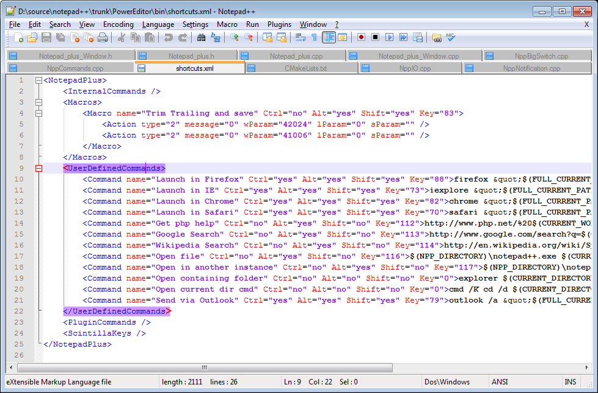

[**SciTE**](http://www.scintilla.org/SciTE.html) is another free text-editor that has regex functionality. However, it uses a variation that may be different enough from the examples in this book as to cause frustration.

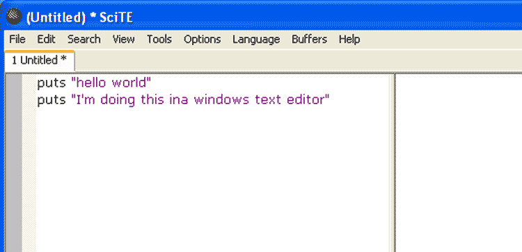

[**EditPadPro**](http://www.editpadpro.com/) is a commercial product but considered one of the best text-editors for Windows and its regular expression support is extremely strong. It comes with a free trial period.

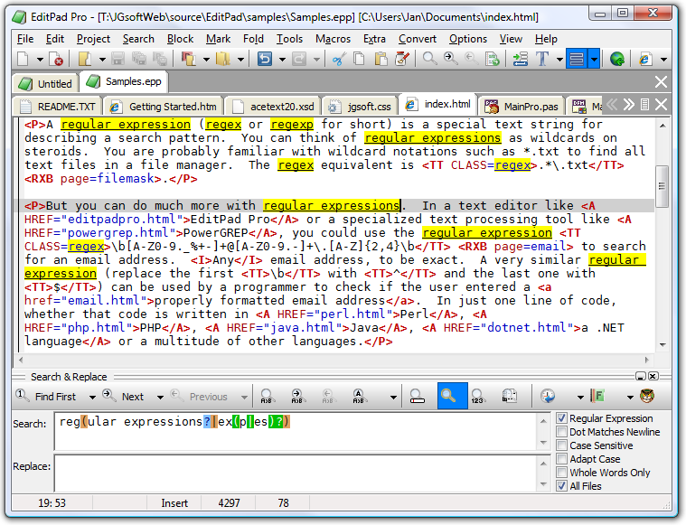

## Mac Text Editors

Even in this era of Apple dominance, it's a fact of life that Apple PCs have generally less choice of software compared to mass-market Windows PCs. Luckily for us, Apple has a few solid offerings.

[**TextWrangler**](http://www.barebones.com/products/textwrangler/ "Bare Bones Software | TextWrangler") is a full-featured, well-designed text-editor, a sampling of [Bare Bones Software's commercial product, BBEdit](http://www.barebones.com/products/bbedit/index.html?utm_source=thedeck&utm_medium=banner&utm_campaign=bbedit).

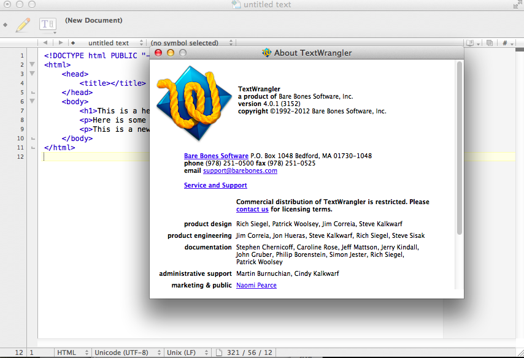

[**TextMate**](http://macromates.com/) has long been a favorite of developers. It comes in a commercial and open-sourced version.

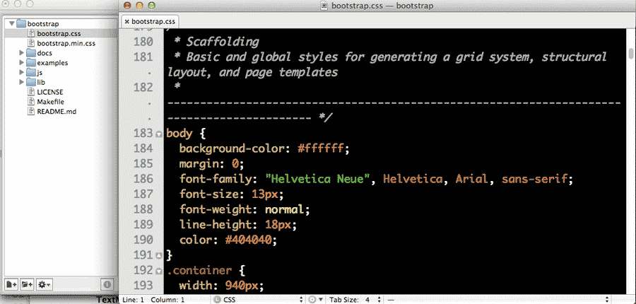

## Sublime Text

I'm giving Sublime Text its own section, not just because it's the editor I use for most programming, but because it is available on Windows, Macs and Linux. It also comes with a generous trial period.

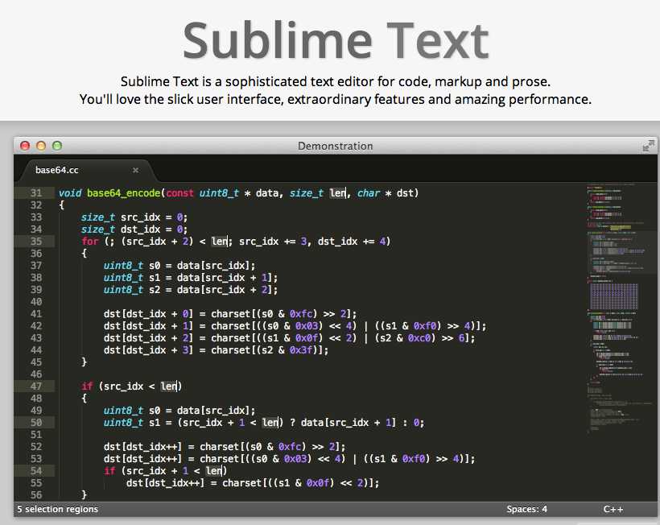

Its price may seem pretty stiff, but I recommend downloading it and using it on a trial-basis. I don't know if I can advocate paying $70 if all you intend to do is regular expressions and text formatting.

However, if you are thinking about getting into programming, then it is most definitely worth it. It's a program I spend at least two to three hours a day in, even on off-days, and makes things so smooth that it is undoubtedly worth the up-front money.

## Online regex testing sites

If you don't want to install a new program yet, then you can follow along with online sites.

[Rubular](http://rubular.com/) is a great place to test regexes. It implements the Ruby programming language's variant of regexes, which, for our purposes, has everything we need and more. And despite its name, it doesn't involve writing any Ruby code.

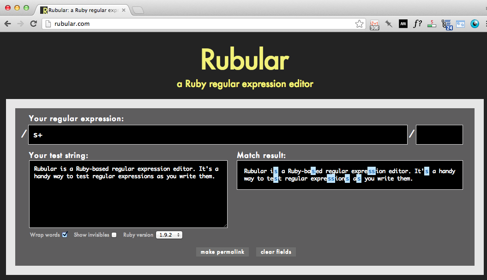

### Trying out Rubular

Before you go through all the work of looking for a text-editor, downloading, and then installing it, we can play with regular expressions in our web browser with Rubular.

Point your browser to: [http://rubular.com](http://rubular.com)

**Copy and paste** the following text into the Rubular text box:

> The cat goes catatonic when you put it in the catapult

Now, in the top text input, between the two forward slashes (`/` is the forward slash, not to be confused with the `\` backslash), enter in the following regex:

	cat
	
That's right, just the word "cat", literally. This is a regular expression, though not a very fancy one. 

In Rubular, all instances where this simple regular expression matches the text &ndash; i.e., "cat" &ndash; are highlighted:

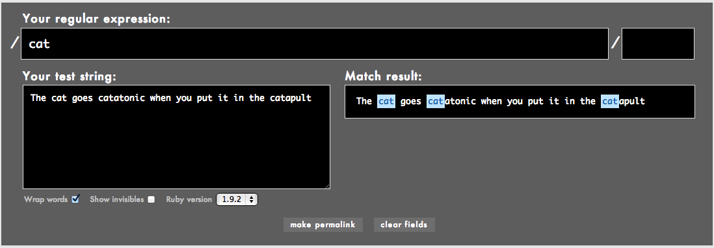

OK, let's add some *actual* regex syntax. Try this:

	cat\b
	

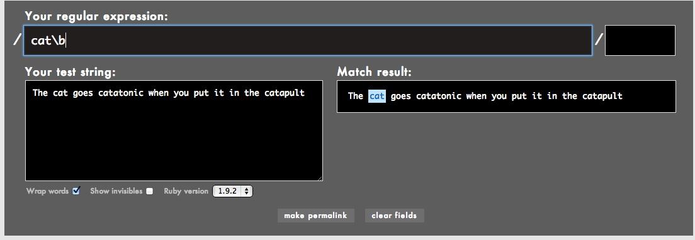
	
Rubular will immediately highlight a new selection. In this case, it actually unselects the "cat" that is part of "**cat**apult" and "**cat**atonic". As we'll soon find out, that `\b` we added narrowed the selection to just the word "cat", just in case we want to replace it with "mouse" but not end up with "**mouse**apult" and "**mouse**atonic"

Here's a slightly more useful regular expression example. Copy and paste the following text into Rubular's field titled **Your test string**:

> Yesterday, at 12 AM, he withdrew $600.00 from an ATM. He then spent $200.12 on groceries. At 3:00 P.M., he logged onto a poker site and played 400 hands of poker. He won $60.41 at first, but ultimately lost a net total of $38.82.

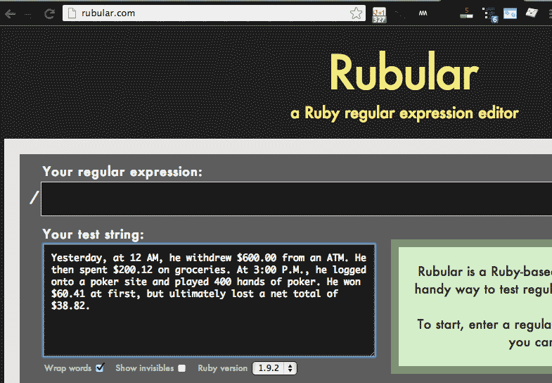

In the field titled, **Your regular expression:**, type in **backslash-d**:

	\d
	
In the field titled, **Match result**, you'll see that every numerical digit is highlighted:

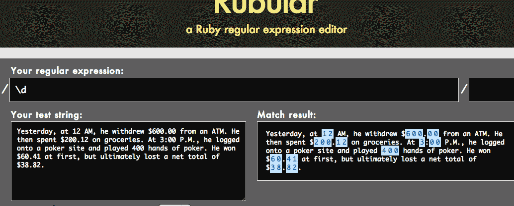

Now try entering this into the regular expression field:

	\.\d{2}
	
This matches a period followed by two numerical digits, no matter what those digits are:

> Yesterday, at 12 AM, he withdrew $600**.00** from an ATM. He then spent $200**.12** on groceries. At 3:00 P.M., he logged onto a poker site and played 400 hands of poker. He won $60**.41** at first, but ultimately lost a net total of $38**.82**.
	
Why might we want to do this? One use might be to round all money amounts to the dollar. Notice how the highlight doesn't occur around any other instances of two-numerical digits, including "**12** AM" and "**40**0 hands of poker"

### Sublime Text example

Using a regex in a text-editor is just as simple as the Rubular example. However, most of the text-editors I've mentioned here do not interactively highlight the matches, which isn't too big of a deal.

Sublime Text is an exception though, and just to show you that regexes work the same in a text editor as they do on Rubular, here's a screenshot:

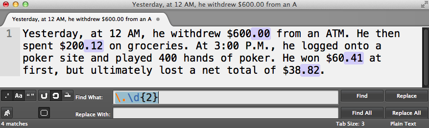

------

For some of you, the potential of regular expressions to vastly improve how you work with text might be obvious. But if not, don't worry, this was just a basic how-to-get-started guide. Read on for many, many more practical examples and applications.

