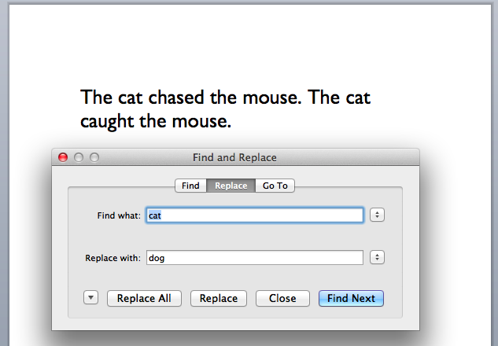

{#better-find-and-replace}
# A better Find-and-Replace

As I said in the intro, regular expressions are an invaluable component of a programmer's toolbox (though there are many programmers who don't realize that).

However, the killer feature of regular expressions for me is that they're as easy-to-use as your typical word processor's **Find-and-Replace**. After we've installed a proper text-editor, we already know how to use regexes.

## How to find and replace

Most readers already know how to use Find-and-Replace but I want to make sure we're all on the same page. So here's a quick review.

Using your computer's basic text editor: Notepad for Windows and TextEdit for Macs.

In modern Microsoft Word, you can bring up the **Find-and-Replace** by going to the **Edit** menu and looking for the **Find** menu. There should be an option called **Replace...**

Clicking that brings up either a side-panel or a separate dialog box with two fields. 

* The top field, perhaps labeled with the word **Find**, is where you type in the term that you want to *find*.

* The bottom field, usually labeled with the word **Replace**, is where you type in the term that you want to **replace** the selection with.

So try this out:

Find
: `t`

Replace
: `r`

If you hit the **Replace All** button, all `t`'s become `r`'s. If you hit just **Replace**, only the first found `t` becomes an `r`.

You also have the option to specify case insensitivity, to affect the capital `T` and the lowercase `t`.

### Replace All vs Replace

For the purposes of this book, we'll usually talk about replacing **all** the instances of a pattern. So assume that when I refer to **Find-and-Replace** I actually mean **Find-and-Replace-All*, unless otherwise stated.

## The limitations of Find-and-Replace

OK, now that we understand what basic **Find-and-Replace** is, let's see where it comes up short. Take a look at the following sentence:

> The **cat** chased the mouse. The **cat** caught the mouse.

Suppose we want to change this protagonist to something else, such as a `dog`:

> The **dog** chased the mouse. The **dog** caught the mouse.

Rather than replace each individual `cat`, we can use **Find-and-Replace** and replace both `cat` instances in a single action:

### The cat is a catch

Now what happens if we want to replace the `cat` in a more complicated sentence?

> The **cat** chased the mouse deep down into the catacombs. The **cat** would reach a state of catharsis if it were to catch that mouse.

Using the standard **Find-and-Replace**, we end up with this:

> The **dog** chased the mouse deep down into the **dog**acombs. The **dog** would reach a state of **dog**harsis if it were to **dog**ch that mouse.

The find-and-replace didn't go so well there, because matching `cat` ends up matching not just `cat`, but *every* word with `cat` in it, including "**cat**harsis" and "**cat**acombs".

### Mixed-up date formats

Here's another problem that find-and-replace can't fix: You're doing tedious data-entry for your company sales department. It's done old school as in, just a simple list of dates and amounts:

    12/24/2012, $50.00
    12/25/2012, $50.00
    12/28/2012, $102.00
    1/2/2012, $90.00
    1/3/2012, $250.00
    1/10/2012, $150.00
    1/14/2012, $10.00
    2/1/2013, $42.00

The problem is that when January **2013** rolled around, you were still in the habit of using **2012**. A find-and-replace to switch `2012` to `2013` won't work here because you need to change only the numbers that happened in January.

---

So how does regular expressions fix this problem? Here's the big picture concept: Regexes let us work with *patterns*. We aren't limited to matching just `cat`; we can instead match these patterns:

* `cat` when it's at the beginning of a word
* `cat` when it is at the end of a word
* `cat` when it is a standalone word
* `cat`, when it appears more than 3 times in a single sentence. 

In the `cat`-to-`dog` example, the pattern we want to find-and-replace is: *the word "cat", when it stands alone and not as part of another word (like "catharsis")*

In the scenario of the mixed-up dates, the pattern we want to match is: *The number "2012", if it is preceded by a "1/", one-or-two other numbers, and another "/"*

Without regexes, you have to fix these problems by hand. This might not be a problem if it's just a couple of words. Even manually performing a dozen **Find-and-Replaces** to fix every variation of a word is tedious, at worst.

But if you have a hundreds or thousands of fixes? Then tedious becomes painful or even impossible.

## There's more than find-and-replace

Big deal, right? Being able to find-and-replace better is hardly something worth reading a whole book for. And if all I had to show you was text-replacement tricks, I'd agree.

But if you're a real data-gatherer or information-seeker, the real power of regular expressions is to find if and where *patterns exist at all*. Maybe you have a list of a million invoices that can't be put in Excel and you need to quickly filter for the six-figure amounts. Or you have a 500-page PDF and you need a fast hack to highlight proper nouns, such as names of people and places. 

In these cases, you don't know precisely what you're looking for until you find it. But you *do* know the *patterns*. With regular expressions, you'll have a way to describe and actually *use* those patterns.

