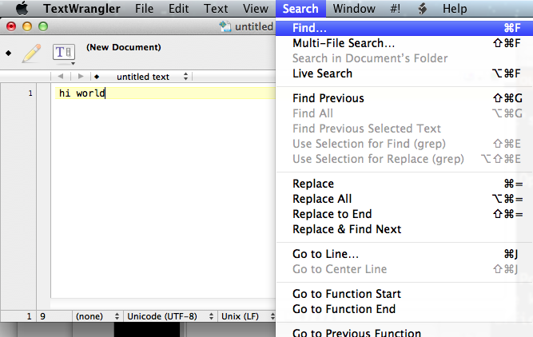
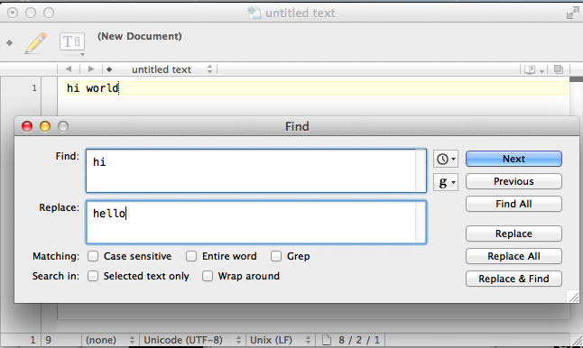
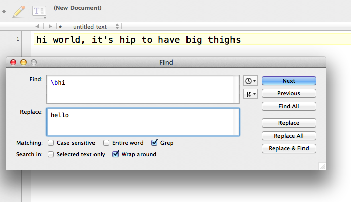
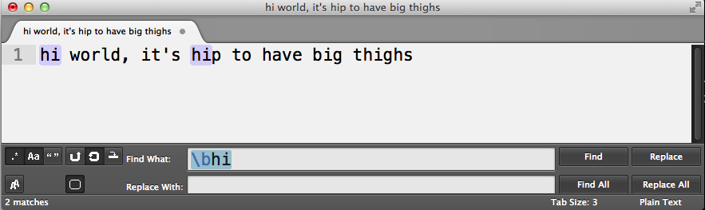
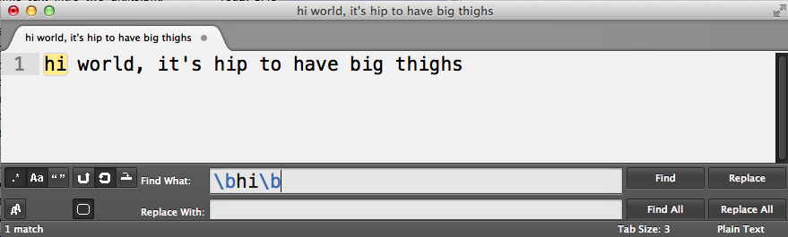
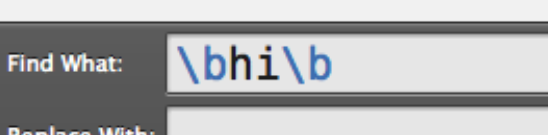
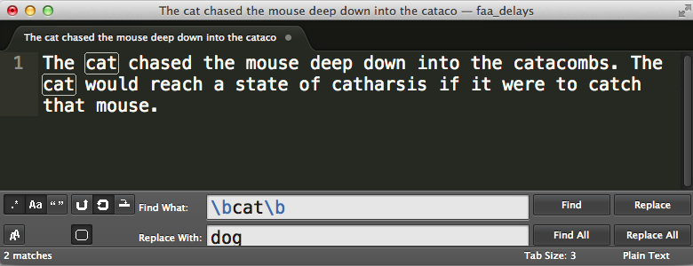

{#word-boundary}
# Your first regex

%% Todo: Notepad++ image

Let's try writing our first regular expression. 

1. Open up your text editor and type in the following:

       hi world

2. Pop open the **Find-and-Replace** dialog menu. You can do this either with the keyboard shortcut, usually **Ctrl-F** or **Cmd-F** (this is the most efficient way to do this). Or you can go up to the menubar.

    Here's how to do it in Textwrangler (Mac):

    

    And in Notepad++ (Windows):

    (Todo): Image

3. Our goal is to replace `hi` with `hello`. So in the **Find** field, type in: 

       hi

4. In the **Replace** field, type in 

       hello

   The Find-and-Replace dialog should look like this:

    

{pagebreak}

5. Hit the **Replace** button. The text should now look like this:

       hello world

By now, you're probably thinking, *what gives, I thought we were doing regular expressions, not find-and-replace!* Well, this technically *is* a regular expression, albeit a very simple and mostly useless one. Remember that regular expressions are *patterns*. In this case, we were simply looking for the pattern of `hi`.

Regular expressions are not necessarily all code. They usually contain *literal* values. That is, we are looking to **Find-and-Replace** the word `hi`, literally.

## Hello, word boundaries

Now let's try a regex that uses actual regex syntax. In your text editor, type out this sentence:

    hi world, it's hip to have big thighs

Once again, we want to replace `hi` with `hello`. But if you try the standard **Find-and-Replace**, you'll end up with:

    hello world, it's hellop to have big thelloghs

So replacing the *literal* pattern of `hi` won't work. Because we don't want to just replace `hi` &ndash; we want to replace `hi` when it *stands alone*, not when it's part of another word, such as "t**hi**ghs"

What we need is a **word boundary**. This will be our first *real* regular expression syntax.

## Word boundaries

A **word-boundary** refers to both the beginning or the end of a word.

But what is a *word*, exactly? In terms of regular expressions, any sequence of one-or-more alphanumeric characters &ndash; including letters from A to Z, uppercase and lowercase, and any numerical digit &ndash; is a *word*. 

So a **word-boundary** could be a space, a hyphen, a period or exclamation mark, or the beginning or end of a line (i.e. the **Return** key).

So `dog`, `a`, `37signals`, and `under_score` are all **words**. The phrase `upside-down` actually consists of *two* words, as a **hyphen** is not a **word-character**. In this case, it would count as a **word boundary** &ndash; it ends the word `upside` and precedes the word `down` 

The regex syntax to *match* a **word boundary** is `\b`

In English, we would pronounce this syntax as, "backslash-lowercase-b"

**Important note:** The **case** of the character matters here. `\B` and `\b` are not the same thing.

------

Before thinking too hard about this (e.g., *what the heck does the backslash do?*), let's just try it out. Revert the sentence (i.e. **Undo**) to its pre-`hello` version. 

In the **Find** field, type in: 

    \bhi

In the **Replace** field, type in (as we did before):

    hello

Before we hit **Replace All**, we need to tell our text-editor to enable regular expressions (or else it will look for a literal `\bhi`). In TextWrangler, this checkbox is somewhat ambiguously labeled as **Grep**. Other text editors will label the checkbox as **Regular expression**.

Here's what it looks like in TextWrangler:

Here's what it looks like in Sublime Text (which annoyingly uses indecipherable icons as options &ndash; mouseover them to see what they stand for):

**Note:** In Sublime Text, the matches are highlighted as you type in the pattern. Also, with regular expressions enabled, Sublime Text helpfully color codes the regex syntax. Notice how the `\b` is a different color from `hi`

Here's the Notepad++ version:

**Note:** It may be necessary to check the **Wrap around** option, which directs the text-editor to look for all matches, from wherever your cursor currently is, to the end of the document, and then back to the top.

However, you should not have to check anything else (besides whatever option enables regular expressions), including **Case sensitivity** (you want to be case *sensitive*), **Entire word**, **Selected text only**, or any variation thereof.

After we hit **Replace All**, we'll have this sentence in our text-editor:

    hello world, it's hellop to have big thighs

Well, that's a little better than before. When we were trying to match just `hi`, we ended up changing `thighs` to `thelloghs`. 

However, with the regular expression `\bhi`, we *constrained* the pattern to match `hi` only when it was the first part of a word &ndash; which is not the case when it comes to "t**hi**ghs"  

However, that didn't quite help us with `hip`, which was changed to `hellop`

So how do we exclude the word "hip" from being caught by the pattern? With another word-boundary. Try figuring out the solution yourself before glancing at the answer below:

If you look at the pattern, `\bhi\b`, you might wonder, *why isn't that "h" affected by the backslash?* After all, it comes right after the `b` and seems to look like one blob of a pattern. 

But as I mentioned before, the backslash affects *only* the character that comes *immediately* after it. 

To reiterate this, look at how Sublime Text interprets the regular expression. The instances of `\b` are in light blue &ndash; they represent special characters in regex syntax. The letters `h` and `i`, rendered in black, are simply the *literal* alphabetical characters:

I've reprinted the regex pattern, but highlighted the parts that are actual regex syntax. The non highlighted part &ndash; `hi` &ndash; is simply the letters `h` and `i`, literally.

## Escape with backslash

We're going to see a lot of this **backslash** character (not to be confused with the *forward-slash* character, `/`). Its purpose in regex syntax is to **escape** characters.

At the beginning of this chapter, I described the pattern `hi` as the pattern for the *literal* word of `hi`. Similarly, a regex pattern that consists of `b` is going to match a *literal* `b`.

But when we have a **backslash** character *before* that `b`? Then it's not a *literal* `b` anymore, but it's a *special* kind of `b`. The backslash can be thought of *escaping* the character that *follows* it from its usual meaning.

In this case, the letter `b`, when preceded with a `\`, **will no longer match a literal** `b`.

Instead, as we saw earlier, "backslash-b" is the regex way of saying, **word-boundary**.

------

Before moving on, let's really ground the concept of the **backslash** in our heads. Re-enter the original sentence:
 
    hi world, it's hip to have big thighs

And do a **Find-and-Replace** for the *literal* letter `b` and replace it with a symbol of your choosing, such as the underscore sign, `_`

Before you hit "Go", try to predict the result. You should end up with something like this:

    hi world, it's hip to have _ig thighs

What happened here? Well, because we only specified the letter `b` for our pattern, only the literal `b` in the sentence was affected. Now revert back to the original sentence and change the **Find** field to a `b` preceded by a backslash, i.e. `\b`

It'll be harder to predict what this does. But you'll end up with this:

    _hi_ _world_, _it_'_s_ _hip_ _to_ _have_ _big_ _thighs_

What happened here? Our pattern looked for word-boundaries, which occur at the beginning and end of every word. Thus, `hi`, turns into `_hi_`.

The transformation of `it's` maybe a little more confusing. It ends up as: 

    _it_'_s_

This makes sense if we defined word-boundary as being the boundary of *consecutive letters*. The apostrophe, `'`, of course, is not a letter, and so it serves as much of a word-boundary as a space.

##### Exercise

Let's go back to the problem described in the previous chapter with the dog-and-cat sentence:

> The cat chased the mouse deep down into the catacombs. The cat would reach a state of catharsis if it were to catch that mouse.

What is the regex needed to change all instances of `cat` to `dog` without affecting the words that happen to have `cat` inside of them?

###### Answer

Find
: `\bcat\b`

Replace
: `dog`

----

Congratulations on learning your first regex syntax. Word boundaries are a very useful pattern to match, and not just for finding `cats`. Sometimes we want to match just the last &ndash; or the first &ndash; digit of a string of characters, for instance.

That **backslash** character will be a recurring character in our regex exploration, and one that has different effects when combined with different characters and contexts. For now, it's good enough to tell it apart from its *forward*-facing sibling.

