-# Regex Fundamentals

# Removing emptiness

It's funny how empty space can cause us so much trouble. In the typewriter days, you were out of luck if you decided that a double-spaced paper should be single-spaced. Today, electronic word processing makes it easy to remove empty lines. Regular expressions make it even easier.

## The newline character

What happens when you hit **Enter/Return**? You create a **new line** in your document and your cursor jumps to the beginning of that line so that you can begin filling in that new line.

The "character" created by hitting **Enter/Return** is often referred to as the **newline character**. This is how we represent it in regex syntax:

	\n
	
**Major caveat:** Newlines are a simple concept. However, different operating systems and regex flavors treat them differently. In *most* cases, we can simply use `\n`. 

*However*, you may find that that doesn't work. If so, try `\r` (think of `r` as standing for **R**eturn)

If you are using **TextWrangler**, you can basically substitute `\r` every time that I refer to `\n`. Other Mac text editors, including **TextMate** and **Sublime Text**, use `\n` to represent newlines.

---------

Let's try *adding* a newline character. Given the following phrase:

	Hello,world
	
Replace that **comma** with a **newline**

Don't do it the old-fashioned way (i.e. deleting the comment and hitting **Return**). Use **Find-and-Replace**:

Find
: `,`

Replace
: `\n`

In Sublime Text, this is what your **Find-and-Replace** should look like:

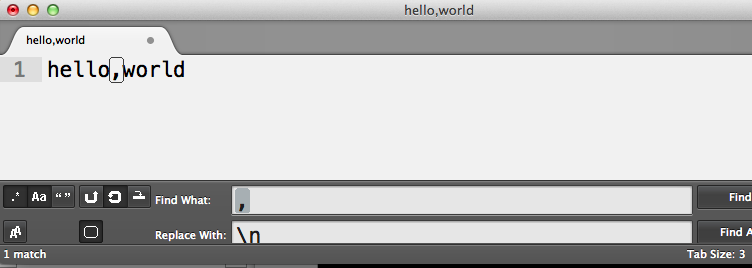

In TextWrangler, you have to use `\r` instead of `\n`:

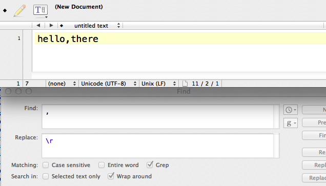

Hit **Replace** and you end up with:

	Hello
	world

One important thing to note: `\n` (or `\r`) is one of the few special characters that have meaning in the **Replace** action. For example, using `\b` will not do anything. But `\n` will replace whatever you specify in the **Find** the field with a newline character

----

Now let's do the opposite: let's replace a **newline** character with a **comma**. Start with:

	Hello
	world
	
To *replace* the newline, simply reverse the operations that we did above:

Find
: `\n`

Replace
: `,`

## Viewing invisible characters

What's the difference between an empty line &ndash; created by hitting **Return** two times in a row &ndash; and an "empty" line, in which you hit **Return**, then the **space bar** a few times, and then **Return** again?

This is what the first kind of empty line looks like, using regex syntax:

	\n\n
	
And this is the second kind of "empty" line:

	\n   \n
	
Of course, this is not the way it looks in a text editor. Both kinds of empty lines will look the same. But to a program, or to the regex engine that attempts to find consecutive newline characters, the two examples above are distinctly different.

Text editors (usually) have an option to show **"invisible characters"**. This option  visually depicts white space with slightly-grayed symbols. In **TextWrangler**, here's the menu option:

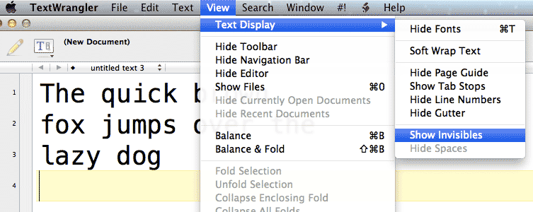 

Here's what the "invisible characters" look like:

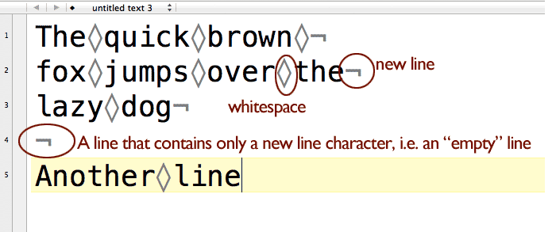

The now-visible "invisible characters" don't add anything to the actual text file. But they are useful for determining when there are actual line breaks (i.e. someone hit the **Return/Enter** key at the end of each line): 

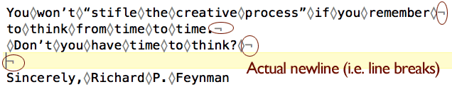

...as opposed to one long line of text that is word-wrapped by the text-editor:

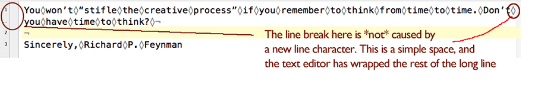

**Note:** *I don't recommend showing invisible characters by default because they clutter up the view. But I'll use it from time-to-time to visualize the actual structure of the text.*

#### Exercise: Fix double-spacing

Given the double-spaced text below:

	The quick brown 

	fox jumps over the 

	lazy dog

Make it single-spaced:

	The quick brown
	fox jumps over the
	lazy dog

###### Answer

First, let's describe what we want to fix in plain English: *We want to delete all lines that are empty*. 

So pop open your text editor's Find-and-Replace tab, enable the regex checkbox, and type `\n` into the **Find** field. And let's **Replace** it with *nothing*; that is, don't put anything into the **Replace** field:

Here's what this looks like in Notepad++

	Todo: TKIMG

And in TextWrangler:

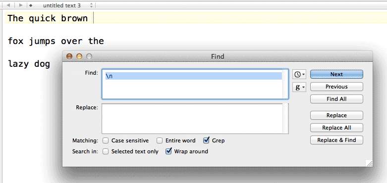

And in Sublime Text 2:

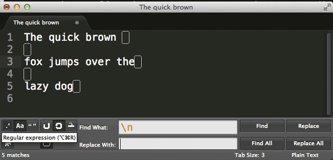

After hitting the **Replace All** button, your text window should look like this:

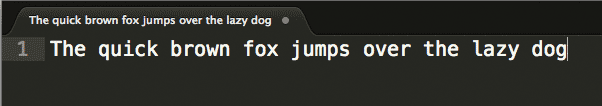

So we ended up replacing all the newline characters. But the result is not a *single-spaced document*, but all the words on a *single line*.

So we need to modify our pattern. If you turn on "show invisibles", you'll get a hint.

###### Answer #2

Remember when I said to think of the "empty lines" as not being *empty*, per se, but lines that contained only a **newline** character? That means immediately *before* an empty line is another newline character:

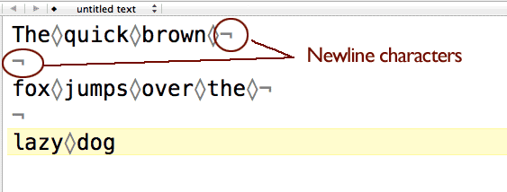

So what is the pattern for a text-filled line that is followed by an "empty line"? **Two** consecutive newline characters. 

In the **Find** field, change the pattern to:

	\n\n

And change the **Replace** field to: 

	\n 
	
In other words, we will be replacing all occurrences of `\n\n` with just a single `\n`, effectively changing this double-spaced document into a single-spaced document:

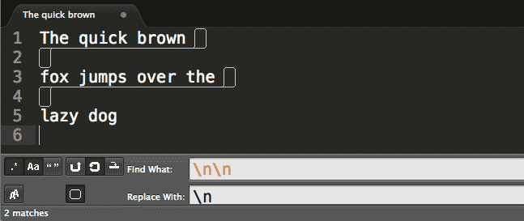

We end up with this:

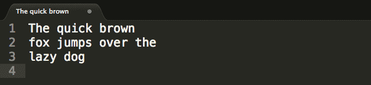

------

So what happens when we want to replace a triple-spaced document? Or a quadrupled-spaced document? It's easy enough to add as many `\n` characters as you need, if annoying.

But what happens if a document contains double-spaced lines in one part, and triple-spaced lines in another? What if we don't really know how many kinds of line-spacing a text-file has? Are we resigned to doing trial and error with **Find-and-Replace**?

No. Of course regular expressions have a way to easily deal with this problem &ndash; or else I wouldn't bother learning them! Read on to the next chapter to find out how to make our pattern flexible enough to handle any of the above variations.

