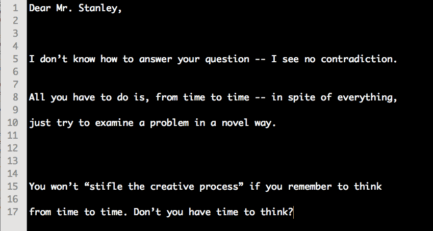
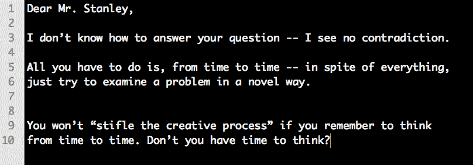
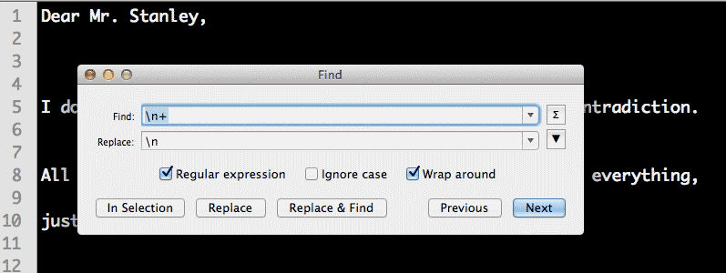
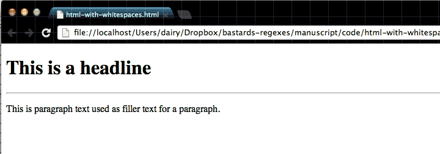
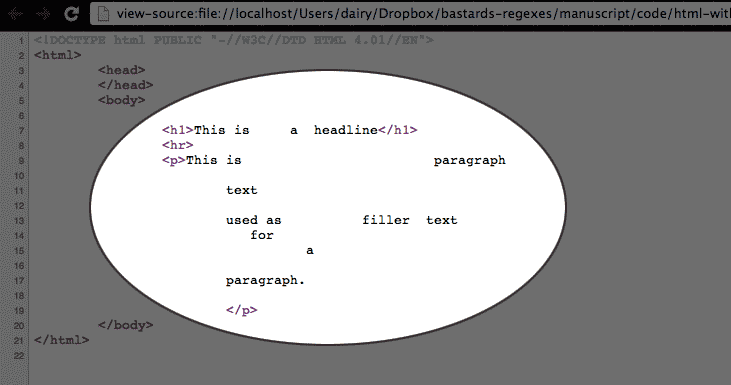
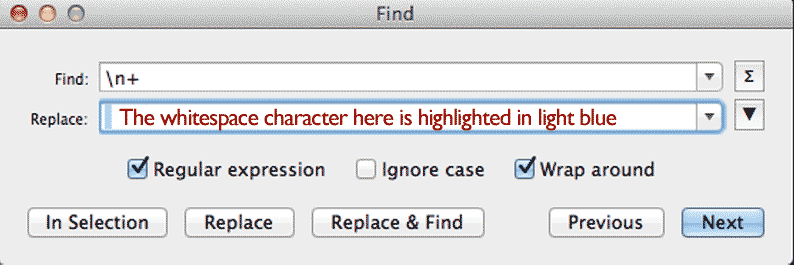
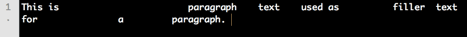

{#plus-operator}
# Match one-or-more with the plus sign
%% ^\n((?:\t|\s{3,}).+\n)(?=^$)

In the last chapter, we cleaned up double-spaced lines. But what if, instead of just double-spaced lines, you had a mix of spacings, where the lines could be double, triple, or quadruple-spaced?

*This letter excerpt comes from Richard Feymnan's published collection of letters,* ["Perfectly Reasonable Deviations from the Beaten Track"](http://www.amazon.com/gp/product/B007ZDDDO0/ref=as_li_ss_tl?ie=UTF8&camp=1789&creative=390957&creativeASIN=B007ZDDDO0&linkCode=as2&tag=danwincom-20")

If you **Find-and-Replace** with the `\n\n` pattern, you'll end up with this:

Which requires you to run the pattern again and again. It seems like regular expressions should have a way to eliminate such trivial repetition, right? Before we find out how, let's state, in English, the pattern that we want to match: 

*We want to replace every instance of where there are at least two-or-more consecutive newline characters.*

## The plus operator

The plus-sign, `+`, is used to match *one or more* instances of the pattern that *precedes* it. For example:

	a+

&ndash; matches any occurrence of one-or-more consecutive *letter* `a` characters, whether it be `a`, `aaa`, or `aaaaaaaaa`

The following regex pattern:

	\n+

&ndash; matches *one-or-more* consecutive **newline** characters, as the `\n` counts as a single pattern that is modified by the `+` symbol.

In other words, the `+` operator allows us match **repeating** patterns.

--------

Let's use the plus sign to change the repeated newline characters in Richard Feynman's letter.

#### Exercise: Varied spacing

Given this text:

~~~
	Dear Mr. Stanley, 

	I don’t know how to answer your question -- I see no contradiction. 

	All you have to do is, from time to time -- in spite of everything, 

	just try to examine a problem in a novel way. 

	You won’t “stifle the creative process” if you remember to think 

	from time to time. Don’t you have time to think?
~~~

Convert it to:

~~~
	Dear Mr. Stanley, 
	I don’t know how to answer your question -- I see no contradiction. 
	All you have to do is, from time to time -- in spite of everything, 
	just try to examine a problem in a novel way. 
	You won’t “stifle the creative process” if you remember to think 
	from time to time. Don’t you have time to think?
~~~

#### Answer

Find
: `\n+`

Replace
: `\n`

This is what our **Find-and-Replace** dialog box will look like:

Before we move on, let's do a little reflection: if the `+` in `\n+` modifies the pattern to match "one or more occurrences of a newline character" doesn't that affect *all* lines that were single-spaced to begin with? 

Technically, *yes*. But since the **Replace** value is set to replace the pattern with a single `\n`, then those single-spaced lines don't see a net-change. 

Try it out yourself. Copy this single-spaced block of text:

{:lang="text"}
	The quick brown fox
	jumps over
	the lazy
	dog

And set **Find** to: `\n+` and **Replace** to: `\n`

You should see no change at all in the text (though technically, all newline characters are replaced with a newline character, there's just no difference).

#### Exercise: Replace consecutive space characters in HTML

The HTML behind every web page is just plain text. However, the text in raw HTML may have a totally different structure than what you actually see.

Here's a simple webpage:

It looks like it's two lines of text, right? If you were to copy-and-paste the webpage to a text-editor, you'd get this:

{:lang="text"}
	This is a headline

	This is paragraph text used as filler text for a paragraph.
	
*However*, if we view the webpage's **source code**:

What happened to all the extra whitespace in the phrase, "This is paragraph text used as filler text for a paragraph"? Web browsers *collapse* **consecutive whitespace**. If there are *one-or-more* space characters, the web browser renders those whitespaces as just *one* whitespace.

And newline characters don't appear at all; they're treated as normal whitespace characters.

(**Note:** *So how is there a line break between the headline and paragraph? That's caused by the HTML tags. But this isn't a HTML lesson so I'll skip the details.*)

This approach to rendering whitespace is referred to as **insignificant whitespace**. 

So why do *we* care? Well, we normally don't. But if you ever get into web-scraping &ndash; writing a program to automatically download web pages to turn them into data &ndash; your program will return the text content of that paragraph as:

{:lang="text"}
	This is                        paragraph
	
		text 
	
		used as          filler  text 
		   for 
		          a 
	  
		paragraph.

Usually, during web-scraping, it's fine to store the raw text in its original form. But sometimes you just want it as a readable sentence:

{:lang="text"}
	This is paragraph text used as filler text for a paragraph. 
	
	
Write the regex pattern(s) that will clean up the insignificant whitespace.

#### Answer

We represent the whitespace character in our pattern as, well, a whitespace. So just use your **spacebar**. Let's start by replacing all consecutive **newline** characters with a whitespace:

Find
: `\n+`

Replace
: ` `

Realize that there is an actual **whitespace** character in the **Replace** box, **not** *nothing*. It's easier to see in the text editor:

The result is this word-wrapped line:

To fix those whitespaces, use the same pattern above except **Find** a whitespace character instead of `\n`, and again, **Replace** with a single whitespace character.

## Backslash-s

Most regex languages have a shortcut symbol that handle both white spaces and newline characters (including text files that use `\r` to represent newlines):

	\s

You can perform the above exercise in one **Find-and-Replace** by just using `\s+` in the **Find** pattern to **Replace** with a single whitespace character.

-------

The plus operator is very useful and we'll be using it many of our patterns to come. Don't get the impression that it's only useful with whitespaces &ndash; the `+` can be combined with any character or pattern. Sometimes the problem is that the `+` matches *too much*, so we'll learn in later chapters how to control the number of repetitions, rather than relying on the plus-operator's one-and-all approach. 
