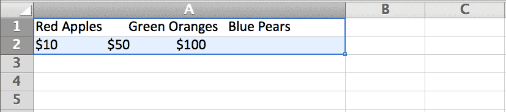
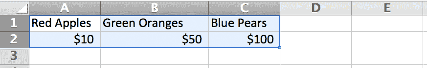
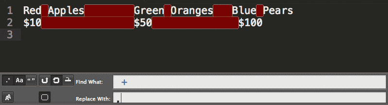
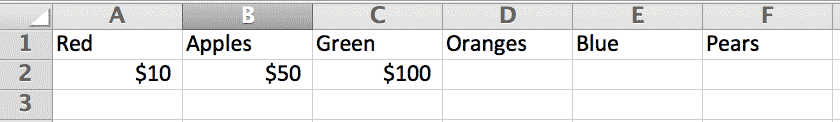

# Specific and limited repetition
%% -30-

The **plus** and **star** operators are a nice catch-all for repeated patterns. But as you can imagine, sometimes you'll need to match something that is repeated more than *once* but less than infinity.

## Curly braces

To capture **n** repetitions of a pattern &ndash; where **n** is the number of repetitions &ndash;  enclose **n** inside **curly braces**

The following pattern:

	a{4}

&ndash; will match *exactly* four `a` characters:

>	"B**aaaa**", said the sheep

-------

This is the simplest form of the **curly braces** notation, let's practice using it before learning the other forms.

#### Exercise: zeros to millions

In the following list of numbers:

	100
	2000
	500000
	4000000
	2000000
	1000000
	8000
	9000000

Replace the **zeroes** with `millions` for the numbers that have **exactly six zeroes**:

	100
	2000
	500000
	4 million
	2 million
	1 million
	8000
	9 million

#### Answer

Find
: `0{6}`

Replace
:  `million`

#### Bonus exercise

Perform the same exercise as above, but with this list of numbers:

	900
	8000000
	90000000
	70000
	100000000
	2000000
	50000000000

If you use the exact solution as in the prior example, you'll end up with this:

	900
	8 million
	9 million0
	70000
	1 million00
	2 million
	5 million0000

Oops. That pattern matched and replaced the *first* six zeroes. What we need is to replace the *last* six zeroes:

	900
	8 million
	90 million
	70000
	100 million
	2 million
	50000 million

Hint: Remember the very [first regex syntax]{#word-boundary} that we learned about?	
	
	
	
#### Answer

Find
: `0{6}\b`

Replace
: ` million`

## Curly braces, maximum and no-limit matching

If we want to match **m-number** of repetitions *but* fewer than **n-number**, we include both **m** and **n** in the curly braces notation:

The following pattern:

	0{3,7}
	
&ndash; will match any text string containing *at least* `3` but no more than `7` consecutive *zeroes*:

> **000**1**0000000**0

However, if you omit the second parameter (the *maximum* number of repetitions) *but* leave in the **comma**, like so:

	0{3,}
	
&ndash; the regex will match a text string containing at least `3` *or more* consecutive *zeroes*.

------

This open-ended form of the curly braces notation is very useful for narrowing down a certain sequence of characters to find and replace. 

#### Exercise: Baa

An essay about sheep has inconsistently spelled "Baa":

> Sheep in Northwest America say "baaaaa." Sheep in Mongolia also say "baaaaaaaa." The deepest conversation I ever had with a sheep went like this:
>
> "Hello!"
> "Baaaaa"
> "You've been a bad sheep!"
> "Baaaaaaaa!"

Fix it so that all instances of sheep-talk are represented simply as `baa`

#### Answer

To get an idea of the flexibility curly braces offer us, try doing this exercise with the `plus` operator:

Find
: `a+`

Replace
: `aa`

Because `+` affects *one-or-more* instances, all single-`a`'s are caught and erroneously replaced with `aa`:

> Sheep in Northwest Americaa saay "baa." Sheep in Mongoliaa aalso saay "baa." The deepest conversaation I ever haad with aa sheep went like this:
>
> "Hello!"
> "Baa"
> "You've been aa baad sheep!"
> "Baa!"

But with curly braces, we can limit what get's replaced to just the instances in which `a`'s are repeated *at least 3 times*:

Find
: `a{3,}`

Replace
: `aa`

#### Exercise: Markdown

Todo: ## Markdown, decrementing # example

Turn 

	# Act I
	### Scene 1
	#### Soliloquy A
	#### Soliloquy B
	# Act 2
	### Scene 1
	### Scene 2
	#### Soliloquy A
	# Act 3
	### Scene 1
	
Into

	# Act I
	## Scene 1
	### Soliloquy A
	### Soliloquy B
	# Act 2
	## Scene 1
	## Scene 2
	### Soliloquy A
	# Act 3
	## Scene 1

#### Answer

Find
: `^#{2}`

Replace
: `#`

What happens without the anchor?

	# Act I
	## Scene 1
	## Soliloquy A
	## Soliloquy B
	# Act 2
	## Scene 1
	## Scene 2
	## Soliloquy A
	# Act 3
	## Scne 1

## Cleaning messily-spaced data

Sometimes you come across a text or PDF file that contains data that you want to put in a spreadsheet:

	Red Apples        Green Oranges   Blue Pears
	$10               $50              $100

	
If you attempt to paste that into Excel, however, you end up with:

That may *look* OK, but that's not what we want. We want each datapoint to occupy its own cell, like so:

In order for this to happen, Excel needs some help. We have to *tell* it that where *there are three spaces or more* that's where a datapoint ends. The easiest way to do that is to *replace* those extra spaces with a symbol &ndash; i.e. a **delimiter** &ndash; that Excel will interpret as a column break.

The most common symbol is a comma. Using the **curly braces** notation, we can replace the consecutive spaces with a comma:

Find
: ` {3,}`

Replace
: `,`

Which converts the text to:

	Red Apples,Green Oranges,Blue Pears
	$10,$50,$100

If you save that text as a **.CSV** (comma-separated values) file, Excel will see those commas and will know that those commas are meant to represent column breaks.

What if we didn't know how to use curly braces and instead used the `+` operator? Then we would've put commas in *every* space:

This of course means commas between each word:

	Red,Apples,Green,Oranges,Blue,Pears
	$10,$50,$100
	
And if Excel interprets each comma as a column break, we end up with:

-------------

When you don't need a **plus**, the **curly braces** are a nice alternative. We'll be using them a lot when we need to perform more precise matching.