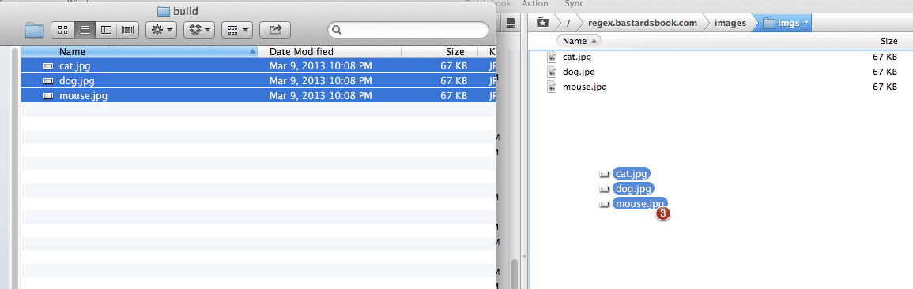
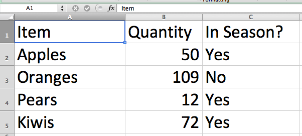

# Anchors: A way to trim emptiness 

In a [previous chapter]{#plus-operator}, we learned how to match consecutive newline characters. This is handy when we want to remove blank lines from a text file.

Another annoying whitespace problem occurs when there is padding between the beginning of the line and the first actual text character.  For example, given these [haikus](http://www.aaronsw.com/weblog/000360):

> do what you feel like
>since the work is abandoned
>    the law doesn’t care
>
>if you use this code
>  you and your children’s children 
> must make your source free

I want them to be formatted so that the leading whitespace is removed and the lines are flush against the left-margin:

>do what you feel like
>since the work is abandoned
>the law doesn’t care
>
>if you use this code
>you and your children’s children 
>must make your source free

*These "license haikus" are courtesy of [Aaron Swartz](http://www.aaronsw.com/weblog/000360 "License Haiku (Aaron Swartz: The Weblog)")*

## The caret as starting anchor

We need a way to match the *beginning of the line*. Think of it as a word-boundary &dash; remember `\b`? &ndash; except that we want a boundary for the *entire line*.

To have a regex include the beginning of the line, use the caret: `^`

The following regex:

	^hello

&ndash; will match the word `hello` if `hello`occurs at the **beginning of the line**, as in the following example: 

> **hello** goodbye

However, `^hello^` will not match the `hello` in the following line:

> goodbye hello

-------

So, in order to remove unneeded spaces at the beginning of a line:

In English
: We're looking to match all whitespace characters that occur at the beginning of a line. We want to replace those characters with nothing (i.e. we want to delete them).

Find
: `^ +` 

Replace
: *(with nothing)*

This regex only affects lines that begin with *one-or-more whitespace characters*. For those lines, those whitespace characters are removed. 

#### Exercise: Add a common directory to a list of files

As a digital photographer, I run into this scenario all the time: I've taken a bunch of photos and want to send them to someone across the world. But with megapixels being so plentiful today, these files in their raw format can weigh in as much as 10MB to 20MB &ndash; too big to send as email attachments. And this client doesn't have a shared Dropbox. 

So the easiest way to send them is to upload them to an FTP or web server. On my computer, I do this by opening the folder, selecting all the files, and dragging them to my server:

The client can then download the files at their leisure. What was `dog.jpg` in my local hard drive can now be found at:

	http://www.example.com/images/client-joe/dog.jpg
	
But how do I tell the client this? Well, first, I select all the filenames on my local hard drive and do a **copy-and-paste** into a text editor. I get something like:

	dog.jpg
	cat.jpg
	mouse.jpg
	
After this it's easy enough to just copy and paste the remote path &ndash; `http://www.example.com/images/client-joe/dog.jpg` &ndash; 3 or so times. But why do that when, with regular expressions, we can do it in one fell swoop?

Use the **caret** anchor to prepend the remote path to the file names:

	http://www.example.com/images/client-joe/dog.jpg
	http://www.example.com/images/client-joe/cat.jpg
	http://www.example.com/images/client-joe/mouse.jpg

#### Answer

Simply "replace" the **caret** with the remote file path:

Find
: `^`

Replace
: `http://www.example.com/images/client-joe/`

Technically, nothing gets *replaced*, per se. The **caret** simply marks the beginning of the line and the replacement action inserts the desired text there.

This is a quick time saver when you just have to add something to a dozen or so lines.

## The dollar sign as the ending anchor

If there's a way to match the beginning of a line, then there must be a way to match the end of a line.

To have a regex include the end of the line, use the dollar-sign:

	bye$

&ndash; this will match the word `bye` if it occurs at the **end of the line**, as in the following example:

> world, good**bye**

However, it will not match the `bye` in the following line:

> goodbye world

------------

#### Exercise: Add a common filename to a list of directories

This is a variation to the previous file path problem. We have a list of directories:

	http://example.com/events/
	http://example.com/people/
	http://example.com/places/

And we need a reference to a common filename:	

	http://example.com/events/index.html
	http://example.com/people/index.html
	http://example.com/places/index.html
	
#### Answer

Find
: `$`

Replace
: `index.html`

### Stripping end-of-line characters

**Comma-delimited files** (also known as CSVs, *comma-separated values*) is a common text format for data. In order for a program like Excel to arrange CSV data into a spreadsheet, it uses the commas to determine where the "columns" are.

For example:

	Item,Quantity,In Season?
	Apples,50,Yes
	Oranges,109,No
	Pears,12,Yes
	Kiwis,72,Yes

In Excel, the data looks like this:

CSV is a popular format and you'll run into it if you get into the habit of requesting data from governmental agencies. Unfortunately, it won't always be perfect.

A common problem &ndash; albeit trivial &ndash; will occur when exporting data from Excel to CSV. If the last column is meant to be *empty* but *isn't* (not all databases are well maintained), every line in the CSV file will have a trailing comma:

	Item,Quantity,In Season?,
	Apples,50,Yes,
	Oranges,109,No,
	Pears,12,Yes,
	Kiwis,72,Yes,
	
This usually won't cause problems, especially in modern spreadsheets such as Excel and Google Docs. But older database import programs might protest. And if you're even a little OCD, those superfluous commas will bother you. So let's wipe them out with a single regex.

##### Inefficient method: remove and replace newlines

If you fully grok newline characters, you realize you can fix the problem by targeting the pattern of: *a comma followed by a newline character*:

Find
: `,\n`

Replace
: `\n`

This *almost* works, except you won't catch the very last line:

	Item,Quantity,In Season?
	Apples,50,Yes
	Oranges,109,No
	Pears,12,Yes
	Kiwis,72,Yes,
	
Why wasn't that trailing comma from the final line deleted? The pattern we used looked only for commas followed by a **newline character**. So if that final line is the *final* line, there is no other newline character. So we have to delete that comma manually.

##### Efficient method: leave the newlines alone

Besides that nagging manual deletion step (which quickly becomes annoying if you're cleaning dozens of files), our **Find-and-Replace** just seems a little *wasteful*. All we want is to delete the trailing comma, but we end up *also* deleting (and reinserting) a newline character.

Using the `$`, however, requires no extra replacement action. It simply asserts that the pattern contains the end-of-the-line, which isn't an actual *character*, per se, in the text. 

In other words, the `$` only detects the end-of-the-line, and so no replacement is actually done at that position.

Try it out yourself. In your **Find** field, match the `$` operator and then **replace** it with nothing: nothing will happen to the text (compare this to replacing `\n` with nothing).

So let's strip the trailing commas using the `$` operator:

Find
: `,$`

Replace
: *(with nothing)*

In English
: We want to find the comma right before the end-of-the-line

## Escaping special characters

If the **caret** and the **dollar sign** denote the beginning and the end of the line, respectively, then it follows that the following patterns don't make much sense:

	abc^Bye
	Hello$world
	
How would `abc` come before the beginning of the line yet be on the same line as `Bye`? Or how could `world` be on the same line as `Hello` and the end of the line character, `$`?

So, with what we know so far, it makes sense that the caret and dollar sign typically serve as  bookends for a regex pattern. However, the following regex may be confusing:

	He gave me \$10+
	
This regex matches the text in bold below:

> **He gave me $100** yesterday
	
The key character here is our friend the **backslash**. We've seen how the backslash, when preceding the letters `b` and `n`, give them *special* meaning: a word boundary and newline character, respectively. 

What happens when the backslash precedes an *already* special character, such as the dollar sign? Then it's just a *literal* dollar sign, as we see in the above example.

##### Exercise: Remove leading dollar signs	

Given this list of dollar amounts in which the dollar sign is mistakenly repeated:

	$$100
	$$200
	$$399
	
Remove the leading dollar sign with a regex that contains the **caret**.

	$100
	$200
	$399
	
	
###### Answer

Find
: `^\$`

Replace
: (with nothing)

----

Anchor characters are not only pretty easy to remember, they're very useful in many regex patterns. I use it frequently for data-cleaning, where a text file may contain unwanted spaces or junk characters at the beginning or end of each line.

