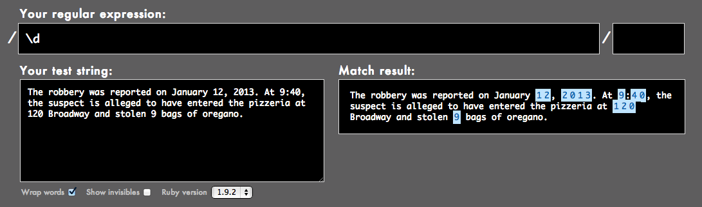
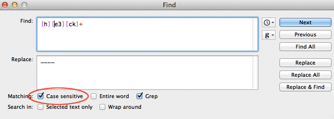
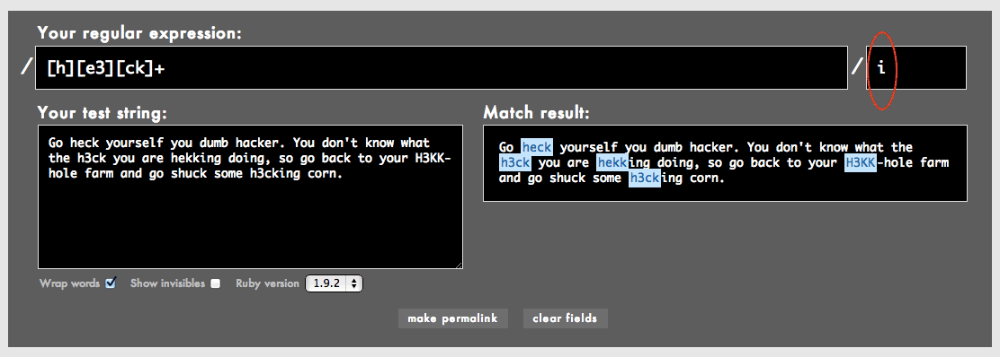
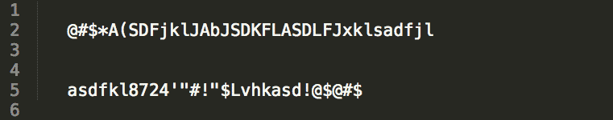
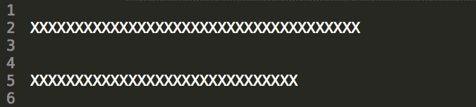
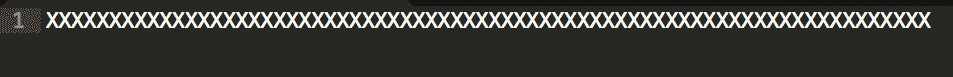
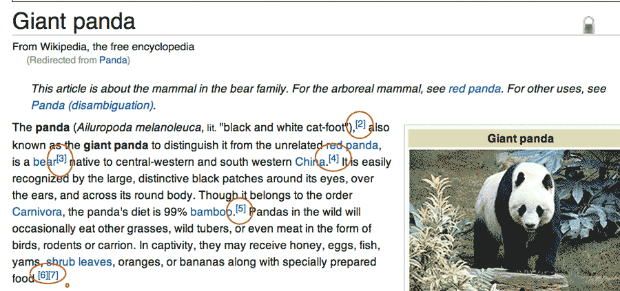

{#chapter-character-classes}
# Matching any letter, any number

Of course, we'll need to work with actual alphabetical letters, numbers, and symbols other than whitespace and newlines. Regular expressions have a set of shortcuts and syntax for this purpose.

## The numeric character class

Using our friend the **backslash**, we can turn a literal letter into a special character to match numbers.

When the letter `d` is preceded by a backslash, the pattern no longer matches the literal letter `d`, but any numerical digit from `0` to `9`:

	\d+
	
Matches:
	
> There are **10010** sheep

We refer to `\d` as a "character class" or "character set" because it affects a set of characters. In this case, `\d` matches *the set (i.e. "class") of characters that are numbers*.

----------

Let's try out the `\d` in a simple exercise.

#### Exercise: Redact the numbers

Given this phrase:

> The robbery was reported on January 12, 2013. At 9:40, the suspect is alleged to have entered the pizzeria at 120 Broadway and stolen 9 bags of oregano.

Replace all the numbers with the letter `X`

#### Answer

Find
: `\d`

Replace
: `X`

Using [Rubular.com](http://rubular.com), we can see an interactive preview of how the text is affected by our pattern:

The result of our **Find-and-Replace**:

> The robbery was reported on January XX, XXXX. At X:XX, the suspect is alleged to have entered the pizzeria at XXX Broadway and stolen X bags of oregano.

#### Exercise: Masking addresses of crime reports

When releasing crime reports, some law enforcement agencies have the policy of masking the exact address of a reported incident, ostensibly to protect the privacy and safety of the victim.

Thus, given the following addresses:

	1289 Houston St.
	402 W. Abbey Ave.
	9 S. 8th Street

The masked addresses would be:

	1200 block of Houston St.
	400 block of W. Abbey Ave.
	00 block of S. 8th Street
	
#### Answer

We basically want to "zero out" the least significant digits of an address. On a street where the address numbers are three or four digits, zeroing out the last two digits generally provides enough vagueness. 

We can use `\d` to match any numerical digit and **curly braces** to target **1 to 2** digits. We also need to use a right-side **word boundary** so that the rightmost digits are matched:

Find
: `\d{1,2}\b`

Replace
: `00 block of`

**Note:** There are competing public interests to consider here: we want to mask the exact address of the incident. However, we also don't want to redact the address to the point that its geographical characteristic is rendered meaningless or paints a misleading characteristic.

For instance, if we changed the range of the curly braces like so:

Find
: `\d{1,3}`

Replace
: `000 block of`

Then the following addresses:

	1520 Broadway, New York, NY
	1001 Broadway, New York, NY
	1999 Broadway, New York, NY

Are effectively mapped to:

	1000 block of Broadway, New York, NY
	1000 block of Broadway, New York, NY
	1000 block of Broadway, New York, NY

In New York, TK	map image

## Word characters

But who wants to just match numerical digits? For the non-discerning regex user, there's syntax for matching all the letters of the alphabet, too:

A **word-character** includes the letters `A` to `Z` &ndash; both uppercase and lowercase &ndash; as well as all the numbers, and the underscore character, `_`

	`\w+`
	
Matches:

> **Blathering_blatherskite42**!!!

------

Let's use `\w` in the previous exercise text.

Find
: `\w`

Replace
: `X`

The result: everything but the punctuation and spaces is X-ed out.

> XXX XXXXXXX XXX XXXXXXXX XX XXXXXXX XX, XXXX. XX X:XX, XXX XXXXXXX XX XXXXXXX XX XXXX XXXXXXX XXX XXXXXXXX XX XXX XXXXXXXX XXX XXXXXX X XXXX XX XXXXXXX.

## Bracketed character classes

As you might guess, not every scenario requires such promiscuous patterns. We can specify just a few characters we want to match using **square brackets**:

	`[bcd]og`

&ndash; will match `bog`, `cog`, and `dog`

---------

Here's a few examples:

Match either `a` or `b`
: `[ab]` (order doesn't matter, so `[ba]` also works)

Match `1`, `2`, `9`, or a space character
: `[1 29]`

Match a dollar sign or any of the word-characters
: `[$\w]`

### Not so special inside the brackets

The previous example has a quirk to it: notice that the `$` is treated as a *literal dollar-sign*. It doesn't represent an end-of-line anchor as we learned about in the previous chapter. This is because *within* the brackets, nearly all the characters act just as normal, non-special characters.

There are a few exceptions to this: the backslash performs its normal escaping capacity, so `[\w]` effectively includes all word-characters. The **hyphen** and the **carat** are also special within the brackets, and we'll learn about their meanings later.

#### Exercise: Just the numbers

In the following list of payments, erase all the symbols that are unrelated to the actual amount:

	$1,200.00
	$5,600.25
	$100.09
	$42,100.01

The decimal points are needed to preserve the fractional values, but we can do away with the dollar signs and commas.

#### Answer

We can remove both punctuation symbols with a character set:

Find
: `[$,]`

Replace
: (with nothing)

The result:

	1200.00
	5600.25
	100.09
	42100.01

Again, note that the `$` does not have to be escaped when inside the brackets.

## Matching ranges of characters with brackets and hyphens

What if you want to deal with not just two characters, but ten characters? Then bracketed character sets get unwieldy:

	[abcdefghij]
	
As I mentioned previously, the **hyphen** acts as a special character inside the brackets. 

Inside square brackets, the **hyphen** denotes a range between two characters:

* `[a-z]` will match any lowercase letter from `a` to `z`
* `[1-5B-G]` matches numbers `1` through `5` and uppercase letters `B` to `G`

----------

#### Exercise: Filtering out naughtiness

If you've ever been in an online chatroom or discussion board, you've probably seen how certain bad words are censored. And sometimes, you see the side effect: users misspelling those censored words so they can  continue in part to convey their true feelings.

So if "heck" is considered an improper word, the discussion board might censor it as "----". So a half-clever user might try to bypass the filter by using "h3ck", "hecck", or "hekk". And if those get blocked, there's a forest of permutations that can be used: "h33ck", "h3kk", "h3cck"

How do those system-moderators *not* spend their day creating infinitely-long lists of naughty words?

Given the following lovely *communique*: 

> Go heck yourself you dumb hacker. You don't know what the h3ck you are hekking doing, so go back to your H3KK-hole farm and go shuck some h3cking corn.

Use character sets to remove all the variations of `heck`.

#### Answer

There's no exact science to this and so, interpretations will vary on whether a misshapen word looks like `heck` enough to merit censoring.

So let's set some bounds. A variation of `heck` is defined as any word that:

* begins with `h`
* ends with `k`
* in which the second character is either `e` or `3`
* in which the in-between letters is a combination of `e`, `c`, `3`, `k`

Since regex is not by default case-insensitive, we have to include both upper and lowercase versions of the letters in our solution:

Find
: `[hH][eE3][cCKk]+`

Replace
: `----`

The result:

> Go ---- yourself you dumb hacker. You don't know what the ---- you are ----ing doing, so go back to your -----hole farm and go shuck some ----ing corn.

#### Case insensitivity flags

In the regex universe, there are several ways to indicate that you want your pattern to ignore the case of letters so that `[a-d]` matches `A`, `a`, `c`, `B`, and so forth.

Since we're just using regex inside of a text editor, there is usually an option to select **case insensitivity**.

[Rubular.com](http://rubular.com) is an emulation of how the Ruby programming language does regexes, so it uses the *flag* system. In Ruby, the letter `i` is used after the regex (which in Ruby, is enclosed with forward slashes `/`) to denote case-insensitivity:

**Note:** you obviously don't have to remember Ruby's implementation details if you don't intend to program in Ruby or to program at all.

If we have case-insensitivity selected, our regex in the previous exercise can be simplified to this:

	[h][e3][ck]+

Or this, if you prefer expressing everything in all-caps:

	[H][E3][CK]+

### What you see is not what you get

If it isn't clear by now, the length of the regex does not necessarily reflect the length of text that it will match. In the above example, `[e3]` matches either `e` *or* `3` &ndash; but just one of those possible characters.

Thus, `he3ck` would *not* be matched. Neither would `h33ck`. That bracketed set, `[e3]`, matches exactly *one* character. However, `[ck]+` matches: `heck`, `hecc`, `heckckck`, and so forth, because of the `+` *one-or-more* repetition modifier.

To hammer home the point, the following pattern:

	[123456789] [a-z]+
	
Matches:

	1 apple
	2 oranges
	
But *not* any of the following lines:

	12 apple
	29 oranges
	
&ndash; because `[123456789] ` matches just a *single* digit followed by a space.
	

{#dot-character}

## All the characters with dot

Sometimes, we just want to match *anything*. Yes, there's a regex for that.

The dot character &ndash; also referred to as a "period" &ndash; simply matches everything &ndash; *except* the newline characters `\r` and `\n`

For example, to match the first three characters of this line:

> **7@%**x90js(las

The pattern is simply:
	
	...

Or, with the **curly braces** notation:

	.{3}

--------

The **dot** matches *everything*: Latin letters, numbers, punctuation, whitespace characters, the entire Chinese alphabet. Every character falls within the dot's purview, *except* for the **newline** character.

For example, given this gibberish:

And applying this **Find-and-Replace-All:**

Find
: `.`

Replace
: `X`

We end up with:

Note that the newline characters are *preserved*. If the dot character had matched and replaced them, then our result would have been one long line of `X` characters:

The dot character is an incredibly flexible piece of our pattern matching toolset. But it's frequently abused because of how easy it is to type a single dot than a specific character set. In the next chapter, we'll learn about [negative character sets]{#negative-character-sets}. Using a combination of that technique with regular character sets is usually preferable &ndash; i.e. safer &ndash; than using the all-matching dot.

### Shorthand notation

As you might have realized, the `\d` syntax we learned at the beginning of this chapter is equivalent to this bracketed set:

	[0-9]
	
And `\w` is equivalent to:

	[A-Za-z_]
	
You can use `\s` to handle all white space characters, including regular spaces (made with the spacebar), tab-characters (`\t`), and newlines (`\n`).

#### Exercise: Cleaning up Wikipedia notations

Every once in awhile when doing research, you find yourself on a Wikipedia webpage, and the content is so great that you want to insert it directly into your own paper. And hey, that's fine, because Wikipedia information is free!

But here's the *first* problem you run into: the best Wikipedia content is oftentimes the most well-annotated content. Which means when you copy-and-paste, you're getting that great text plus all those bracketed numbers, which is not what your own research paper needs:

Here's the text you get when copying-and-pasting from the first paragraph of the [Giant Panda](http://en.wikipedia.org/wiki/Giant_panda) entry:

> The panda (Ailuropoda melanoleuca, lit. "black and white cat-foot"),[2] also known as the giant panda to distinguish it from the unrelated red panda, is a bear[3] native to central-western and south western China.[4] It is easily recognized by the large, distinctive black patches around its eyes, over the ears, and across its round body. Though it belongs to the order Carnivora, the panda's diet is 99% bamboo.[5] Pandas in the wild will occasionally eat other grasses, wild tubers, or even meat in the form of birds, rodents or carrion. In captivity, they may receive honey, eggs, fish, yams, shrub leaves, oranges, or bananas along with specially prepared food.[6][7]

Write the regex needed to remove these bracketed numbers.

#### Answer

We're only dealing with numbers so use the shorthand notation `\d`. And since we're dealing with *literal* bracket characters, we need to escape them:

Find
: `\[\d+\]`

Replace
: *(with nothing)*

What happens if you forget to **escape** those brackets and instead try the following pattern?

Find
: `[\d+]`

The regex engine interprets that as: *match either a digit or a plus sign* (remember that `+` is non-special inside of brackets). The resulting text is:

> The panda (Ailuropoda melanoleuca, lit. "black and white cat-foot"),[] also known as the giant panda to distinguish it from the unrelated red panda, is a bear[] native to central-western and south western China.[] 

(**Note:** Of course, cleaning up the wiki-code is just one issue when copying straight from Wikipedia. The other is proper attribution so you don't come off as a plagiarist. But that's outside of the scope of this book.)

--------------

Character classes give us a great amount of flexibility in matching text. In the [next chapter]{#negative-character-sets}, we'll learn a slight variation: specifying the characters we *don't* want to match.

