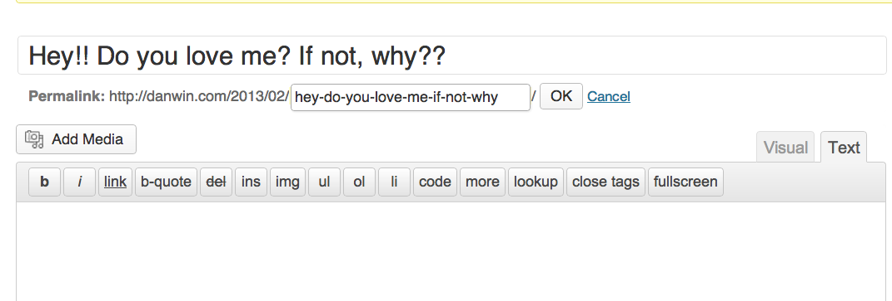

{#negative-character-sets}
# Negative character sets

Now that we know how to *include* sets of characters in our patterns, let's see how to *exclude* them.

The syntax is simple and easy to remember. But it opens up a new range of regex possibilities. So this chapter will re-emphasize the concepts we've covered so far while mixing in new tricks that come from thinking negatively.

With the **square-bracket** notation, we are able to specify a *set* or *range* of characters to match:

Find
: `[bcd]og`

Matches
: "bog" or "cog" or "dog"

But what if we want to match anything *but* those terms, such as "fog" or "hog"?

## Negative character sets

To exclude a set of characters from a pattern, use the same **square bracket** notation as a normal character set, but use a **caret** symbol, `^`, directly after the left-bracket.

The following regex:

	[^abcd]

&ndash; will match any character *except* a literal `a`, `b`, `c`, or `d`

This regex:

	[^0-5]

&ndash; matches any character that is *not* the numbers `0` through `5`.

-------

Let's revisit a previous exercise in which we removed all the non-number/decimal characters:

	$1,200.00
	$5,600.25
	$100.09
	$42,100.01

Using normal character sets, the answer was:

Find
: `[$,]`

Replace
: *(with nothing)*

Using **negative character sets**, we can express the pattern as:

Find
: `[^\d.]`
	
Replace
: *(with nothing)*

In English
: Match all the characters that are *not* a numerical digit or a dot.

**Note:** Remember that the **dot character** *is non-special* inside square brackets.

#### Exercise: URL slugs

If you've ever written a blog post, you may have used software that auto-generated the URL for the post from the *title*. Here's what it looks like in Wordpress:

All the *non-word* characters, such as spaces and punctuation, are turned into dashes. So:

> Hey!! Do you love me? If not, why??

Turns into:

	hey-do-you-love-me-if-not-why

Write the regex needed to do this conversion.

#### Answer

There's at least two equivalent negative sets that can accomplish this:

* `[^A-Za-z0-9_]`
* `[^\w]`

You probably prefer the shorthand version:

Find
: `[^\w]+`

Replace
: `-`

You'll actually end up with this; we don't have a good way to eliminate that trailing slash or lowercase a phrase using regexes alone. But this is close enough:

	Hey-Do-you-love-me-If-not-why-

**Note:** If you don't use the `+` in the pattern, then you won't collapse consecutive non-word-characters into one hyphen and will end up with:

	Hey---Do-you-love-me--If-not--why--

### More shorthand

We know that `\d` is shorthand for `[0-9]`. Negative character sets have their own shortcuts (in most of the major regex flavors that I know of, at least) and they're pretty easy to remember: take the shortcuts you already know and **capitalize the escaped character** to get the negative version:

All non-digits
: `\D`

All non-word-characters
: `\W`

All non-whitespace characters
: `\S`

The regex pattern for the previous exercise could also be expressed as simply as:

	\W+
	
	
##### Exercise: More hecks
	
In the previous chapter, we dealt with message-board-trolls who wanted to get around our ban of the word, `heck`. We assumed they would try such variations as `h3ck` or `hekk`. But using non-letter-characters, such as `*` or `-`, also serve to get the point across, e.g. `h*ck` and `h-ck`. And that's just too much implied civility for our tastes.

So, the problematic text:

> Go heck yourself you dumb hacker. You don't know what the h-ck you are h--king doing, so go back to your H3cK-hole farm and go shuck some h.cking corn.

###### Answer

This one's a little tricky. Your first instinct may be to do something like:

	h\W\Wk

While this would match `h**k` and `h--k`, it wouldn't match `h*ck` or `he*k`. In fact, it wouldn't match `heck`. So we still need to match literal `e`, `3`, `c`, and `k` characters, as well as all non-word characters. We can do this by combining square-bracket notation with negative shortcuts:

Find
: `h[e3\W][ck\W]k`

Replace
: `----`

In English
: Match a word in which: the first character is `h`; the second character is either `e`, `3`, *or any non-word character*; the third character is `c`, `k`, or any non-word character; the fourth character is `k`.

	
-----------

TK conclusion
