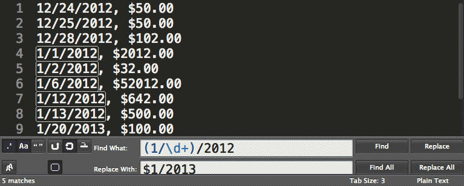
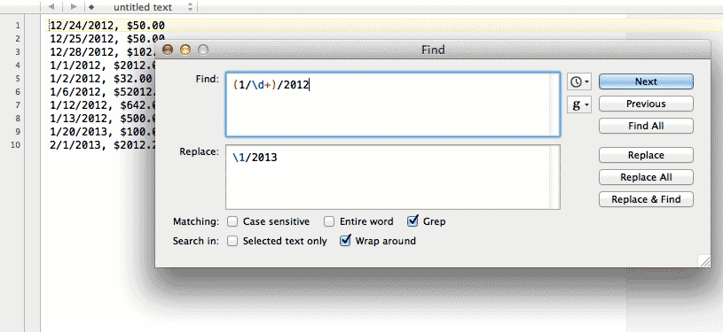

# Capture, Reuse

We've learned how to swiftly replace wide swaths of text. 

But sometimes, the patterns we match contain text that we *don't* want to replace.

For example, given a list of names in *last-name-comma-first-name* format:

	Smith, Shelly
	Perry, Dwayne
	
How do we change it to *first-name last-name*? 

	Shelly Smith
	Dwayne Perry

We still need to keep each part of the name in order to switch them around.

In this chapter, we'll learn how **parentheses** are used to "capture" a pattern that we can later refer to. This is one of the most important features of regular expressions, giving us the flexibility to re-arrange and reformat data to our needs.

## Parentheses for precedence

It should come as no surprise that **parentheses**, `(` and `)`, have special meaning in regex syntax, just as all the other braces (curly and square) do.

Their most basic function in a regex is to add **precedence**. If you remember arithmetic, then you'll recall how parentheses were used to change *order of operations*:

    5 * 5 + 2     = 27
    5 * (5 + 2)   = 35

What kind of *order of operations* can we alter in regexes? Consider how the `+` operator affects the character that immediately *precedes* it:

Find
: `ba+`

Matches
: **baaaaaaaaaa**

With the use of parentheses, we can affect a sequence of characters:

Find
: `(ba)+`

Matches
: **babababa**

Matches
: **ba**aaaaaaaaa

**Note:** In the text above, notice how it matches only `ba` and not any of the following consecutive `a` characters.

##### Exercise

In the following text:

	1 12 100 Apples 9 8 44
	20 700 99 Oranges 2 98 2

Remove *only* the numbers (and the spaces between) that come *after* the names of the fruit:

	1 12 100 Apples
	20 700 99 Oranges

#### Answer

So the basic pattern we're looking for is: *any number of spaces, followed by any number of digits*. This can be expressed as:

	 +\d+

(Note that there is a whitespace character before the first `+` operator)

However, there is more than one occurence of this basic pattern. So we use parentheses to group the basic pattern:

	`( +\d+)`
	
And apply the `+` operator to that grouping:

	`( +\d+)+`
	
And for good measure, we're looking for this pattern at *end* of the line, so throw in the **end-of-the-line anchor**. Our final answer is:

Find
: `( +\d+)+$`
	
Replace
: *(with nothing)*	

## Parentheses for captured groups

Parentheses have what might be called a *major* side effect regarding the patterns they group together. When part of a regex is inside a parentheses, the regex engine contains a **backreference** to the pattern **captured** inside the parentheses.

Let's go back to the *last-name-first-name* example at the beginning of the chapter:

	Smith, Shelly
	Perry, Dwayne

**What's the pattern?**

We want to *capture* the words on both sides of the **comma**.

This is easy enough; the regex pattern is:

	(\w+), (\w+)
	
Ah, but what do we **replace** it with?

### Backreference notation

Up until now, the **Replace** part of the **Find-and-Replace** action hasn't involved many special characters. In fact, nearly none of the special characters in regex-land, such as `+`, `[ ]`, `^`, and so forth, have any meaning beyond their *literal* values.

But the **backslash** still wields its **escaping** power in the **Replace** field.

T>## Backreference notation
T>
T> Inside the **Replace** field, using a **backslash** followed by a number, will denote the value inside the corresponding captured group.
T> In other words, `\1` contains the value of the *first* captured group. And `\2` contains the value for the *second* group, and so forth.
T>
T> Let's consider this simple use of parentheses in a pattern:
T>      
T>       (ab)(cd)(e)
T>
T> If the **Replace** field is set to:
T>
T>       \1\2\3
T>
T> &ndash; then the 1st backreference will contain the letters `ab`; the 2nd backreference contains `cd`, and the 3rd backreference contains `e`

Let's try out backreferences on the list of names:

Find
: `(\w+), (\w+)`

Replace
: `\2 \1`

This is what your text editor's **Find-and-Replace** dialog box should look like:

Todo:IMG

And the result:

	Shelly Smith
	Dwayne Perry

The explanation of the **Replace** field, in English, is: *the last and first names was contained in the first and second captured groups, respectively. So the replacement value is the second backreference, followed by the first backreference.*

W> ## Warning: Regex Differences Ahead
W>
W> I promised you in the introduction that we would stay far away from the relatively minor differences between regex flavors. However, there is at least one nitpick we have to be aware of:
W>
W> In the examples above, I said that the backreference notation involves a **backslash** and a number. *However*, some flavors of regex use a **dollar-sign** and a number.
W>
W> Here's what it looks like in the TextMate editor:
W> Todo: Image
W> 
W> Not a big difference, but obviously something you need to know, as you switch between different text editors and programming languages.
W>
W> For the remainder of this book, we will assume the backreference operator is the **backslash**. You may have to substitute the `$` as appropriate.

Let's practice capturing groups on more complicated names. Convert the following list to this format: *first-name middle-initial last-name*

	Roosevelt, Franklin D.
	Walker, Mary E.
	Berners-Lee, Tim J.
	Williams, Serena J.

The main variation here is that we need a *third* capturing group to contain the middle initial. Also, the names may contain hyphens.

Find
: ([\w\-]+), ([\w\-]+) ([A-Z]\.)

Replace 					      
: $2 $3 $1

A couple of notes: 

1. The hyphen inside square brackets has to be escaped, because, the hyphen in that context is a special character that acts as a *range* (e.g. *from A to Z*, as we see in the third-capturing group).

2. The **dot** character &ndash; `.` &ndash; has to be escaped, because it is a special regex character. In fact, it is a very powerful character that we'll learn about in a [later chapter]{#dot-character}.

## Correcting dates with capturing groups

In a previous chapter, we encountered the problem of trying to fix the year-value on a list of dates:

	12/24/2012, $50.00
	12/25/2012, $50.00
	12/28/2012, $102.00
	1/1/2012, $2012.00
	1/2/2012, $32.00
	1/6/2012, $52012.00
	1/12/2012, $642.00
	1/13/2012, $500.00
	1/20/2013, $100.00 
	2/1/2013, $2012.20
 
If this list is chronological, then the data-entry person forgot to go from 2012 to 2013 when January rolled around.

Let's start with how we selectively target the January dates:

Find
: `1/\d+/2012`

In English
: We are looking for a 1, followed by a forward-slash, followed by one-or-more numerical digits, and then another forward-slash and the sequence `2012`.

Using a capturing group, we wrap the *non-year* part of the date in parentheses. And then we use the backreference `$1` to retrieve the value to use in the replacement:

Find
: `(1/\d+)/2012`

Replace
: `$1/2013` 

In Sublime Text 2, this is what the operation looks like:

Remember that some variations of regex, including the one used in TextWrangler, the backreference involves a **backslash** instead of a dollar sign:

Fixing misshapen dates is one of my most common daily uses for regexes. Dates usually contain an obvious pattern, e.g. `9/5/2010` and `4-7-99`. To get them into a different format &ndash; e.g. `9/5/10` and `04/07/1999` &ndash; can often be accomplished with regex techniques.

#### Exercise: Change the order of date parts

In American day-to-day usage, dates are often formatted as *month-day-year*:

	03-09-2001
	11-14-2012
	05-22-1978
	
However, programmers prefer dates to be in *year-month-day* format:

	2001-03-09
	2012-11-14
	1978-05-22
	
Why? A common operation is to "find the earliest/latest date." To sort date strings, the simplest method for a program is to do it an *alphabetical*-fashion. Think of how you sort words alphabetically:

	Apples
	Oracles
	Oranges
	Ore	
	
The most important letter is the *left-most* one: `A` comes before `O` in the alphabet, so all words that begin with `A` will come before any word that starts with `O`. But what if the words start with the same letter? Then you compare the second letters, and so forth.

This is the same with dates. In the American human-readable format, `03-09-2001` would come *before* `05-22-1978`, as `03` comes earlier in the numerical scale than does `05`. But chronologically, of course, `05-22-1978` is several decades before `03-09-2001`. In the programmer-friendly version, the "biggest" parts of the date come first, i.e. the year, *then* the month and day. This makes sorting easy, because the alphabetical-order of the date text is *the same as the chronological order* of the actual dates.

So, given the human readable version of the dates, write a regex that converts them to the programmer friendly version.

#### Answer

Find
: (\d+)-(\d+)-(\d+)

Replace
: $3-$1-$2

#### Exercise: Zero-pad the dates

The above exercise isn't completely realistic, however, because the human-readable dates are usually written in a more shorthand way:

	3-9-2001
	11-14-2012
	5-22-1978

The month of March, in other words, is written simply as `3`, *not* as `03`

Why is that extra zero there? If you think of the computer-sortable scenario, those extra zeros are vital. Consider the issue of two dates with the same year. In human readable format:

	11-20-2002
	3-20-2002
	
In machine-readable format:

	2002-11-20
	2002-3-20
	
If a program sorted the above dates, `2002-11-20` would come before `2002-3-20`, because the left-most `1` is compared against the `3`. In other words, the *tens* place of `11` is being compared to the *ones* place of `3`, which is not what we want. 

With "zero-padding", though, this isn't a problem:

	2002-03-20
	2002-11-20
	
Given the following dates (in human readable format):

	1-12-1999
	4-6-2002
	3-3-1973
	12-5-2004

Add zeroes where they are needed:

	01-12-1999
	04-06-2002
	03-03-1973
	12-05-2004
	
#### Answer

Your first instinct may be that this requires two regex **Find-and-Replace** operations. However, we can do it with one:

Find
: \b(\d)\b

Replace
: 0$1

In English
: For every single-digit surrounded by word-boundaries, capture the digit. In the replacement text, add a `0` before the captured single digit.

#### Exercise: Pad the year

At the turn of the century, a lot of data systems recorded dates as:

	05-14-89
	12-03-98
	03-15-99
	02-01-00
	07-07-01
	03-08-02
	01-22-12
	

The reasoning was that it's "obvious" that `98` refers to `1998` and `02` refers to `2002`. Of course, it won't be so obvious as we get farther into the 21st century. So write a regex that coverts the two-digit years into four-digits:

	05-14-1989
	12-03-1998
	03-15-1999
	02-01-2000
	07-07-2001
	03-08-2002
	01-22-2012

#### Answer

This is a little bit tricky, not least of which because using a regex here is *not recommended in real life*. If you're working with a big dataset, you *might* have dates that include `1902` along with `2002`. And so you don't want to use a dumb regex to deal with that ambiguity, you'll likely need to write a programming script with some logic and error-handling.

However, sometimes you just need a quick and dirty solution if you *know* your data doesn't contain those ambiguities. In this case, we'll need to use *two* regex operations, one each for pre-2000 and post-2000 dates.

For pre-2000:

Find
: ([89]\d)$

Replace
: 19$1

For post-2000:

Find
: ([01]\d)$

Replace
: 20$1

#### Exercise

	"What in the world?" Mary asked.
	"Hello!" James yelled.
	"Goodbye!" Mary responded.
	
Re-arrange the lines so the speakers come *before* the dialogue.	

	Mary asked: "What in the world?"
	James yelled: "Hello!"
	Mary responded: "Goodbye!"

#### Answer

Let's break down the pattern into its component pieces:

1. We start with a **quotation mark** 
2. We then want to capture all the text (the dialogue) *that is not a quotation mark*. 
3. Then we want to capture all the text (e.g. "James yelled") until the sentence-ending **period**.

**Note:** Remember that the dot-character is not a special character when used inside brackets.

Find
: `"([^"]+)" ([^.]+)\.`

Replace
: `\2: "\1"`

The notation is a little confusing at first. In the first part of the sentence, we're representing the pattern with three quotation marks:

	"([^"]+)"
	
But read out the pattern to yourself: *we are capturing everything that is not a quotation mark between two quotation marks.* 

The middle quotation mark is used to indicate, inside the negative character set, that we do *not* want a quotation mark in that context. We need that third quotation mark to set the bounds of the first captured group. 

As for that awkward literal dot-character at the end, if we didn't include it in the pattern, it would not be *replaced*. Try leaving it out:

Find
: `"([^"]+) ([^.]+)`

Replace
: `\2: "\1"`

And you'll have an awkward trailing period in your lines:

	Mary asked: "What in the world?".
	James yelled: "Hello!".
	Mary responded: "Goodbye!".
	

## Using parentheses without capturing

What if we want to use parentheses just as a way to maintain order of operations?

To make a set of parentheses non-capturing, simply add a **question-mark** and **colon** immediately after the left-brace:

	 (?:this-pattern-isnt-captured)(this is captured)

**Note:** To re-emphasize, these symbols must show up *one after the other* in that *exact* order.

Ergo:  `(?:x)` is not at all the same as: `( ?:x)`

-------

Given this text:

	1. J.R. Ewing
	2. A.C. Thompson
	3. T.A.L. Glass

And wanting to change it to:

	1. Ewing
	2. Thompson
	3. Smith
	
The pattern we seek to match is:

* A number followed by a period	(captured)
* A series of uppercase letters, each followed by a period (but *not* captured)
* A string of word-characters (captured)

This is the Find-and-Replace:

Find
: (\d+\.) ([A-Z]\.)+ (\w+)

Replace
: \1 \3

Note that we don't use the second backreference, which contains the initials (e.g. `A.C.`, `T.A.L.`). It seems kind of wasteful to even store it if we don't need it. So we need a way to group a pattern we want to repeat &ndash; `[A-Z]\.` &ndash; *without capturing it*.

This is where we could use **non-capturing parentheses**:

Find
: (\d+\.) (?:[A-Z]\.)+ (\w+)

Replace
: \1 \2

The only change is the addition of `?:` to the second-set of parentheses in the **Find** field. In the **Replace** field, there is no longer a 3rd backreference to use, as only two of the three parenthetical groups are capturing.

-----

Capturing groups allow us to transform text in very powerful ways. And with great power, comes great potential to use them *badly*. We'll find out in later chapters that parentheses have several other uses, and so it behooves us to use capturing groups only when we need to, else our regex patterns become an incomprehensible tangle of parentheses.

This is a good time to read other information sources about regexes. [Regular-expressions.info](http://www.regular-expressions.info/brackets.html) in particular has a great summary of the nuances of captured groups.

