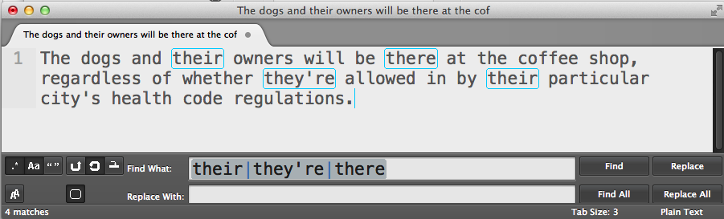

# Optionality and alternation

The two concepts in this chapter are actually more straightforward than what we've covered in past chapter. I like to think of them as ways to accommodate human error and inconsistency. Were phone numbers entered with or without dashes? Did an author use "J.F.K." or "JFK" to refer to John Fitzgerald Kennedy? Did your British and American writers use "grey" and "gray" throughout the text?

The optionality and alternation operators help us create patterns when we don't know for sure if certain characters exist in the text.

## Alternation with the pipe character

The pipe character &ndash;  `|` &ndash; is used to match *either* pattern on the left and right of it:

	`a|b|c`
	
&ndash; will match either `a`, `b`, or `c`. This of course is equivalent to `[abc]`

However, the pipe character can be used to match groups of characters as well:

	`happy|\d+`
	
The above pattern would match either `happy` *or* a consecutive string of numbers.

------

	
#### Exercise: There, there

The simplest use of alternation can save you from having to run multiple Find operations. Considering that the uses for "their", "they're", and "there" are commonly mixed up, write a regex that would allow you to quickly locate and iterate through each of the homonyms.

#### Answer 

Find
: `they're|their|there`

### Precedence with alternation

The alternation operator (the **pipe** character) has a low priority when it comes to priority of operations.

For example, the pattern `gra|ey` will match `gra` or `ey`. It would *not* match `grey` nor `gray`

To match `grey` or `gray`, we would have to use **parentheses** to group operations to our preferred order:

	gr(a|e)y
	
Here, the "preferred" order is that the regex engine, when it reaches the third character in the pattern, looks for either an `a` or an `e`. Without the parentheses &ndash;

	gra|ey

&ndash; the regex engine considers only alternating between the strings `gra` and `ey` 

#### Exercise: Who is/are 

In a particular document, you've noticed that the writer has consistently, but *incorrectly* used "who's" and "who is" &ndash; for example:

> She wants to know **who's** the agents responsible for this.

Write a regex that will do a mass-replace of all instances of `who's` and `who are` &ndash; but use parentheses to create a pattern that is *not* simply,  `who's|who is`

#### Answer

Find
: `who('s| is)`

Replace
: `who are`

**Note:** It's not necessary in this case, but it's a good habit to use **non-capturing parentheses** when you're not intending to capture a pattern:

	`who(?:'s| is)`

## Optionality with the question mark

We've learned how to match patterns even when we don't know exactly what letters or numbers they contain or how many times they occur.

But what if we're unsure if part of a pattern even exists?

The use of the `?` in a regex allows us to designate whatever pattern *precedes* it as being *optional*

	cats?
	
Matches:
	
> The **cat** is one of the **cats**
> The **cat**nip tastes like **cats**up 

Another way to think of the question mark is that it matches *zero-or-one* occurrences.

-------

#### Exercise: Match phone number input

Your web application has allowed users to enter in phone numbers in whatever format they feel like, including:

	1-555-402-9800
	(555)-951-8341
	5551549763
	1-(555)-091-5060

Write a regex using the **optionality operator** that can match any of the phone number examples above.

#### Answer

The solution pattern is ugly and convoluted looking. But if you take it one character at a time, from left to right, and simply put a **question mark** after each optional character, it's not at all tricky. Remember to **backslash-escape** the special characters.

Find
: `1?-?\(?\d{3}\)?-?\d{3}-?\d{4}`

### Precedence with parentheses and optionality

As with most regex operators, the `?` only affects what directly precedes it, whether it's a single character or a complex pattern.

If what you make optional is more than just a single character, then use **parentheses** so that the entire group of characters is modified by the `?`

Given a list of dollar amounts:

> $200
> $19.20
> $610.42
> $1.5
> $15

The following pattern &ndash;

	\$\d+\.\d{2}?
	
	
&ndash; will match only two of the listed amounts:

> $200
> **$19.20**
> **$610.42**
> $1.5
> $15

However, by using parentheses to make optional the literal decimal point *and* the two numerical digits, we can match all the listed amounts:

	\$\d+(\.\d{1,2})?
	
And again, if you aren't intending to use parentheses to capture any part of the text, then you should use the non-capturing version:	
	
	\$\d+(?:\.\d{2})?

Which might lead you to ask: *how do you tell those question marks apart?* 

For example, consider the pattern:

	Studio (?:\d\d)?:

Which would match the following strings:

	Studio 54:
	Studio :

how does the regex engine know that the *second* question mark acts as the optional operator, but the *first* question mark acts as a way to make those parentheses non-capturing?

Think of it logically: *if* that *first* question mark made the left-side parentheses optional...how would that even make sense? The key difference is that the first question mark comes directly after a (non-literal) left-side parentheses. The engine just *knows* that you aren't intending to make it optional, because it just wouldn't make sense.

But even though it makes logical sense, it'll still be hard for us humans to read. If you're ever confused, just remember to take things character by character and you'll usually be able to suss it out.

 

#### Exercise: Mr. Ms. Mrs. Miss 

#### Answer
Find
: `M(r|r?s)\.?`

Mr?r

Or: 
Find
: `who('|s)e?`

|its|it's|they're|there|their|your|you're|who's|whose|than|then|where|wear

#### Exercise: There, there, redux

An alternative to using alternate-syntax. Use the optionality feature to match all these variations:

	they're
	theyre
	their
	there

#### Answer

Find
: `the[iry]'?[er]`

Note: while this is an amusing exercise, this regex is so unreadable that you're better off just using straight-up alternation:

	their|there|they'?re
		

#### Exercise: Zip codes

In the United States, zip codes can come in at least two different forms: five-digit and nine-digit:

	10020-9020
	10018
	60201-3277
	

In the following city listings, add commas to delimit the state, zip code, and country information. 

Change:

	New York 10020-9020 United States
	California 90210 U.S.
	
To:

	New York, 10020-9020, United States
	California, 90210, U.S.
	

#### Answer

The optional part of the pattern is the hyphen and the four numerical digits:

Find
: `( \d{5})(-\d{4})?`

Replace
: `,\1\2,`

You might wonder what the second capturing group *captures* if nothing is actually there, as in the case of `California 90210 U.S.`, in which the optional pattern doesn't exist. For our purposes, nothing is captured in that second group and nothing is thus affected by it.

But again, you should be using non-capturing parentheses as possible. Here's an alternate solution:

Find
: `( \d{5}(?:-\d{4})?)`

Replace
: `,\1,`

----

If it hasn't hit you by now, regular expressions are *extremely* useful in finding terms and datapoints when you don't quite know what they look like. The alternation and optionality operators make it even more convenient to add flexibility to our searches.
