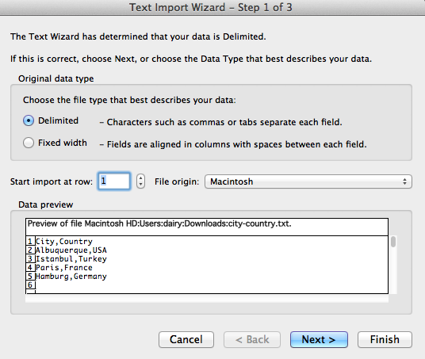
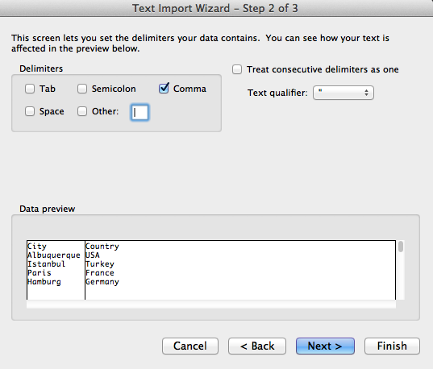
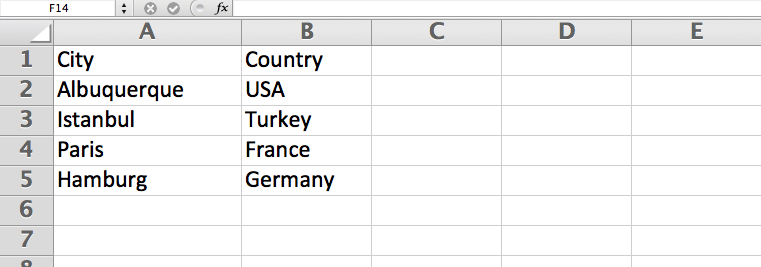
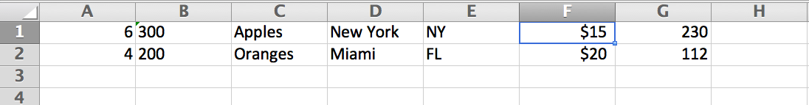

-# Regexes in Real Life
# From Text to Data to Visualization (TODO)

If you work with data and believe data is something that comes from a spreadsheet or database, then this is where regular expressions can become an indispensable. 

## Why learn Excel?

But *why* data? Why spreadsheets?

(todo)

## The limits of Excel (todo)

## Delimitation

### Comma-separated values (CSV)

CSV files use commas to separate the data fields. Thus, when you open a CSV file using Excel, Excel uses commas to determine where the columns are.

**Note:** *If you don't have Excel, you may be able to follow along with another spreadsheet program, like Google Drive. However, the point of this next step is a trivial demonstration, because the point of this chapter is to show you how to manage data _without_ Excel. So all we're doing here is just a point-and-click exercise.*

1. Save the following text as a text file; you can use `.txt` as the file extension:

		City,Country
		Albuquerque,USA
		Istanbul,Turkey
		Paris,France
		Hamburg,Germany

2. Modern spreadsheet programs will surmise that the text file is delimited. Excel, for example, will pop-up its **Text Import Wizard**: 

	

3. Although it's pretty obvious here, Excel then asks you to tell it what delimiter character it should use. By choosing **Comma**, we can see a preview of how the columns will be arranged:

	

4. After that, we have a text file in spreadsheet-manipulable format:

	

#### Exercise: Make CSV data from an address list

So turning CSV-delimited text to spreadsheet data is easy. but what if we want to get turn non-delimited text into a spreadsheet? We would have to convert that text into a delimited format. And this is where regexes come in.

Given this list of cities and postal codes:
TODO
New York, NY 10006

Convert it to this CSV format:

TODO

"Hey," you might say, "there's *already* a comma in that data." True, but it's just typical punctuation. If we were to open this list in Excel, we would end up with:

TODO:

So we need to use a simple regex to at least separate the state from the zipcode.

#### Answer

Find
: (.+?), ([A-Z]{2}) (\d{5})

Replace
: \1,\2,\3

#### Exercise: More complex addresses

Believe it or not, the easily-fixed scenario above is one that I've seen keep people from making perfectly usable, explorable data out of text.

However, for most kinds of text lists, the cleanup is a little more sophisticated than one extra comma. Here's an example in which we have to deal with street names and addresses:

	50 Fifth Ave. New York, NY 10012
	100 Ninth Ave. Brooklyn, NY 11416
	9 Houston St. Juneau, AK 99999
	2800 Springfield Rd. Omaha, NE 55555

Change to: 

	50,Fifth Ave.,New York,NY,10012
	100,Ninth Ave.,Brooklyn,NY,11416
	9,Houston St.,Juneau,AK,99999
	2800,Springfield Rd.,Omaha,NE,55555
	

#### Answer

This is simply breaking each part of the line into its own separate pattern:

1. Street number: consecutive digits at the beginning of the line

2. Street name: A combination of word characters and spaces until a literal period is reached.

3. City: A combination of word characters (actually, just letters) and spaces until a comma is reached.

4. State: Two uppercase letters

5. Zip: Five consecutive digits

Find
: `^(\d+) ([\w ]+\.) ([\w ]+), ([A-Z]{2}) (\d{5})`

Replace
: `\1,\2,\3,\4,\5`

##### Exercise: Complicated street names

Street address lists can get way more complicated than this, of course. The following exercise tests how well you understand the differences between [laziness and greediness]{#laziness}.

A> **Note**: Don't fret if you don't get this. Fully grokking this kind of exercise requires better understanding of what's going on under the hood, which is what I've avoided presenting so far. Regular-expressions.info has a [great lesson on the internals](TK).

What if our list of **street names** had periods *within* them? 

	100 J.D. Salinger Ave. City, ST 99999
	42 J.F.K. Blvd. New York, NY 10555
	
Then the pattern for a street name would consist more of just word characters and spaces *until* a literal period.

So this is the pattern we have to alter:

	([\w ]+\.)

Now a simple solution may be just to include the literal dot inside the character set, like so:

	([\w .]+)

Find
: `^(\d+) ([\w .]+) ([\w ]+), ([A-Z]{2}) (\d{5})`

Replace
: `\1\2\3\4\5`

	
And that kind of works:

	100,J.D. Salinger Ave.,City,ST,99999
	42,J.F.K. Blvd. New,York,NY,10555

But notice the improper delimitation in the second line. The street name &ndash; `J.F.K. Blvd. New` &ndash; includes part of the city name &ndash; the `New` from `New York`.

This happens in any case where the city name consists of more than one word: 

	50 Fifth Ave. New York, NY 10012
	
Becomes:
	
	50,Fifth Ave. New,York,NY,10012
	
Instead of what we had before:

	50,Fifth Ave.,New York,NY,10012
	

Why did this happen? The subpattern `[\w .]+` was just *greedy*. We need to make it *lazier*	so that the street name field doesn't unintentionally swallow part of the city name.
	
TODOTK: (move to laziness chapter?)
	
###### Answer

The pattern for the street name is now:

	 ([\w .]+?)

And the complete pattern is otherwise unchanged:

Find
: ^(\d+) ([\w .]+?) ([\w ]+), ([A-Z]{2}) (\d{5})

How did one question mark make all the difference?	

## Mixed commas and other delimiters

Again, just to hammer home the point: data is just *text*, with structure. Why does that structure have to be defined with commas? It *doesn't*, so good for you for realizing that.

We can basically use *any* symbol to structure our data. Tab-separated values, a.k.a. **TSV**, is another popular format. In fact, when you copy and paste from a HTML table, such as this Wikipedia HTML chart, you'll get:

TKTK

And most modern spreadsheet programs will automatically parse pasted TSV text into columns. Copy-and-pasting from the above text will get you this in Google Docs:

TKTK

Heck, you can just copy-and-paste directly from the webpage into the spreadsheet:

TKTK

### Collisions

The reason why most data-providers *don't* use just "any" symbol to delimit data, though, is a practical one. What happens if you use the letter `a` as a delimiter &ndash; nut your data includes lots of `a` characters naturally?

You *can* do it, but it's not pretty. 

But we don't have to dream of that scenario, we already have that problem with using comma delimiters. Consider this example list:

	6,300 Apples from New York, NY $15,230
	4,200 Oranges from Miami, FL $20,112
	
There's commas in the actual data, because they're used as a grammatical convention: `6000`, for example, is `6,300`.

In this case, we *don't* want to use commas as a delimiter. The pipe character, `|`, is a good candidate because it doesn't typically appear in this kind of list.

We can delimit this list by using this pattern:

Find
: `^([\d,]+) (\w+) from ([\w ]+), ([A-Z]{2}) (\$[\d,]+)`

Replace
: `\1|\2|\3|\4|\5`

And we end up with:

	6,300|Apples|New York|NY|$15,230
	4,200|Oranges|Miami|FL|$20,112

#### Exercise: Someone else's comma-mess

Let's pretend that someone less enlightened than us tried to do the above exercise with comma-delimiters. They would end up with:

	6,300,Apples,New York,NY,$15,230
	4,200,Oranges,Miami,FL,$20,112

Which, when you open in Excel as CSV, looks predictably like nonsense:

So we need to fix this mess by converting *only* the commas meant as delimiters into pipe symbols (or a delimiting character of your choice *ndash; the `@` or tab character would work in this case).

#### Answer

Well, we obviously can't just do a simple **Find-and-Replace** affecting all commas. We need to affect only *some* of the commas.

Which ones? In this exercise, it's easier to look at the commas we *don't* want to replace:

	6,300
	$15,230
	4,200
	$20,112

So if the comma is followed by a number, we *don't* want to replace it.

There's multiple ways to do this, here's how to do it with **capturing groups** and a **negative character set**:	

Find
: `,([\D])`

Replace
: `|\1`

In English
: Replace all instances of commas followed by a *non-number* character (and *capture* that character) and replace them with a pipe character and that non-numbered character.

(**Note:** Remember that `\D` is a shorthand equivalent to either `[^\d]` or `[^0-9]`, though some flavors of regex may not support it.)

#### Answer: Using lookarounds

The more efficient way would be to use a lookahead, though, to avoid needing a backreference. Here's how to do it with a **negative lookahead**:

Find
: `,(?!\d)`

Replace
: `|`

In English
: Replace all commas &ndash; the ones *not* followed by a number &ndash; with a pipe character.

But you can use a **positive lookahead** too &ndash; if you combine it with a negative character set:

Find
:  `,(?=\D)`

Replace
: `|`

In English
: Replace all commas &ndash; the ones that *are* followed by a *non-number* character &ndash; with a pipe character.

Whatever solution you use, you'll end up with:

	6,300|Apples|New York|NY|$15,230
	4,200|Oranges|Miami|FL|$20,112

## Dealing with text charts (todo)

## Completely unstructured text (todo)
http://www.springsgov.com/units/police/policeblotter.asp?offset=0

(Colorado Springs patrol reports)

	^(\d+) Record ID (\w+ \d{1,2}, \d{4}) Incident Date (\d{1,2}:\d{1,2}:\d{1,2} *\wM) Time (.+? Shift [IV]+)Division (.+?)Title(.+?)Location((?:.|\s|\n)+?)Summary(.*?)Adults\s*Arrested ([\w .\-']*?)PD.+\n.+

	\1\n\2\n\3\n\4\n\5\n\6\n\7\n\8\n\9

#### Exercise: Email headers

From: Sarah Palin <spalin@alaska.gov>
To: John McCain <jmccain@mccain08.com>
Subject: Becoming VP
Date: TK

#### Answer

Find
: From: (.+?) <(.+?)> 

Find
: To: (.+?) <(.+?)>

Find
: Subject: (.+)

(full answer TK)

## Moving in and out and into Excel

TODO

#### Exercise: Wordiness of Hamlet

1. Break apart "Hamlet" by line per speaker
2. Import into Excel
3. TODO

Step 1. Remove all non dialogue lines

Let's manually remove everything, including player listings, from the first line to line 55:

> SCENE.- Elsinore.

###### a. All lines that are flush (134 lines)

Examples:

> <<THIS ELECTRONIC VERSION OF THE COMPLETE WORKS OF WILLIAM
SHAKESPEARE IS COPYRIGHT 1990-1993 BY WORLD LIBRARY, INC., AND IS
> ACT III. Scene I.
> Elsinore. A room in the Castle.
> Enter King, Queen, Polonius, Ophelia, Rosencrantz, Guildenstern, and Lords.
> THE END

Find
: `^[^\s].+$\n?`

Replace
: *with nothing*

###### b. Replace all stage directions (98 lines)

Right justified text

Examples:

			   Enter Rosencrantz and Guildenstern.
			   Exeunt [all but the Captain].
			   Enter Sailors.
		       Throws up [another skull].
           Exeunt marching; after the which a peal of ordnance
                                                  are shot off.

This is tricky. We do not want this:

	Ham. Why,

	           'As by lot, God wot,'

	 and then, you know,

	           'It came to pass, as most like it was.'

Find
: `^\s{15,}.+?\. *$\n`

Replace
: *with nothing*

###### c. Remove all stage exits in dialogue (38 examples)

Example
: Adieu, adieu, adieu! Remember me.                      **Exit.**

Find
: `^(.{10,}) {5,}.+`

Replace
: `\1`

###### d. Remove all asides (in brackets) (55 occurences):

Example
: Ham. **[aside]** A little more than kin, and less than kind!

Find
: `\[.+?\]`

Replace
: *with nothing*

##### Concatenate dialouge

    1. Play. What speech, my good lord?
    Ham. I heard thee speak me a speech once, but it was never acted;
       or if it was, not above once; for the play, I remember, pleas'd

Find
: `^ {2}(\w{1,4}\.(?: \w{1,4}\.)?) +((?:.|\n)+?)(?=\n^ {2}\w)`

Replace
:

Remove all newlines inside speech:

Find
: `\n(?!")`

Collapse consecutive whitespace

Find
: `\s{2,}`

Replace
: `\s`

#### Exercise: Example FAA Control towers (TODO)

##### Step 1. Clean the data

When you select-all, copy, and paste, you get this jumble:

	FAA Contract Tower Closure List
	(149 FCTs)
	3‐22‐2013
	LOC
	ID Facility Name City State
	DHN DOTHAN RGNL DOTHAN AL
	TCL TUSCALOOSA RGNL TUSCALOOSA AL
	FYV DRAKE FIELD FAYETTEVILLE AR
	TXK TEXARKANA RGNL-WEBB FIELD TEXARKANA AR
	GEU GLENDALE MUNI GLENDALE AZ
	...
	Page 1 of 4FAA Contract Tower Closure List
	(149 FCTs)
	3‐22‐2013
	LOC
	ID Facility Name City State
	PIH POCATELLO RGNL POCATELLO ID
	SUN FRIEDMAN MEMORIAL HAILEY ID
	

The first step is to remove all the non-data lines. The easiest way to do this is to first consider: *what are the data lines here?*

The data lines we want to keep have four fields: A 3-letter airport code, the airport's name, the city, and the two-letter state code.

So, the non-data lines are anything that: 1. *don't* begin with three capital letters, and 2. *don't* end with a two-letter state code.

(TODO )
Find
: `^[A-Z]`

	([A-Z]{3}) +(.+?) {3,}(.+?) {3,}([A-Z]{2})

	$1\t$2\t$3\t$4

	http://www.faa.gov/news/media/fct_closed.pdf

	Delete useless lines

	^(?:\s.+|\s*)\n

	Change to location:
	(.+?)\t([A-Z]{2})$ (city, state)

