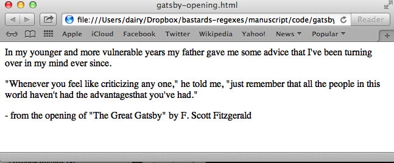

# From Data to HTML (TODO)

This chapter examines some hacks to convert delimited data into webpages. There's no new technique here, just more examples of the versatility of regular expressions as well as the importance of properly-delimited data.

HTML expertise is not required. At the heart of it, converting data into HTML is simply a visualization exercise.

## Simple HTML tricks

Regexes are actually not ideal for dealing for *any* kind of HTML. But in simple situations, where you need to a quick specific conversion, a regex can be real time saver compared to doing it the old-fashioned way or writing a short program.

### Plaintext to paragraphs

HTML doesn't respect whitespace. That is, if you create a HTML file that contains well-formatted plain text, like:

> In my younger and more vulnerable years my father gave me some advice
that I've been turning over in my mind ever since.
>
>"Whenever you feel like criticizing any one," he told me, "just
remember that all the people in this world haven't had the advantages
that you've had."
>
> - from the opening of "The Great Gatsby" by F. Scott Fitzgerald

Not only will the webpage contain only text, but the text won't even be properly formatted:

All whitespace characters, including line breaks, are rendered as simple spaces. And consecutive whitespace is rendered as a single space.

To make line paragraphs, we have to wrap each paragraph with `
` tags:

   
In my younger and more vulnerable years my father gave me some advice
    that I've been turning over in my mind ever since.

   
"Whenever you feel like criticizing any one," he told me, "just remember
    that all the people in this world haven't had the advantages that you've
    had."

   
- from the opening of "The Great Gatsby" by F. Scott Fitzgerald

If each paragraph in the text file is a single line, then regex will create proper paragraphs for the browser to display:

Find
: `(.+)`

Replace
: `
\1
``

However, if there's a physical line break (rather than just the effect of word-wrap) for each line, the above regex will result in this:

   
In my younger and more vulnerable years my father gave me some advice that 

   
I've been turning over in my mind ever since.

   
"Whenever you feel like criticizing any one," he told me, "just remember 

   
that all the people in this world haven't had the advantages that you've 

   
had."

   
- from the opening of "The Great Gatsby" by F. Scott Fitzgerald

The regex will have to be a little more complicated. One possible solution is: 

In English
: Look for a sequence of *any* character, including newlines, until we reach a line that contains only whitespace (or nothing)

Find
: `((?:.|\n)+?)^ *(?:\n)`

Replace
: `
\1
`

The use of non-capturing groups makes the solution a lot more complicated looking than you'd think. And it's not a bulletproof one either, but it'll work in a pinch.

### Turning URLs into anchor links

Given a pipe-delimited text list of URLs and the text that describes the links, generate an HTML list of hyperlinks (a.k.a. anchor tags).

Turn this:
   An example site|http://example.com
   A search engine|http://google.com
   A news site|http://cnn.com

Into:
   <a href="http://example.com">An example site</a>
   <a href="http://google.com">A search engine</a>
   <a href="http://cnn.com">A news site</a>

Find
: (.+?)\|(.+)

Replace
: <a href="\2">\1</a>

### Stripping HTML

A common chore is removing all HTML from a document.

If you assume that all HTML markup is enclosed within opening and closing angle brackets &ndash; `<` and `>` &ndash; then this is pretty easy:

Given this:

   <!doctype html>
   <html>
   <head>
      <title>Example Domain</title>
      <meta charset="utf-8" />
   </head>
   <body>
   

      <h1>Example Domain</h1>
      
 
         This domain is established to be used for illustrative 
         examples in documents. You do not need to
         coordinate or ask for permission to use this domain in examples, 
         and it is not available for
         registration.
      

      

         <a href="http://www.iana.org/domains/special">
            More information...</a>
      

   

   </body>
   </html>

We can use the dot character to match everything from a left-angle-bracket to a right-angle-bracket:

Find
: <.+?>

Replace
: *(with nothing)*

The result is imperfect: lots of unnecessary white space, plus the meta tag (the **title**, in this case), is left behind. But again, sometimes you just need a quick fix to get raw text. This is about as fast as highlighting from the web browser and copying-and-pasting to a text file:

   Example Domain
      

      Example Domain
       
         This domain is established to be used for illustrative 
         examples in documents. You do not need to
         coordinate or ask for permission to use this domain in examples, 
         and it is not available for
         registration.
      
      
         
            More information...

### Stripping style from tags

Microsoft Word comes with a feature to turn a `.doc` file into `.html`. However, the translation is imperfect for a lot of real-life use cases.

For example, Word will specify the *style* of each element on the page, such as the font-color and size. When you're working with someone who had to type their blog post in Word, but you need it to have the styles of the blog, you have to remove the Word-inserted style.

Here's an example of Word-generated HTML:

(todo)

## Tabular data to HTML tables
Turning an Excel spreadsheet to HTML tables

## Mocking full web pages from data

## Visualizations
Simple transformations
