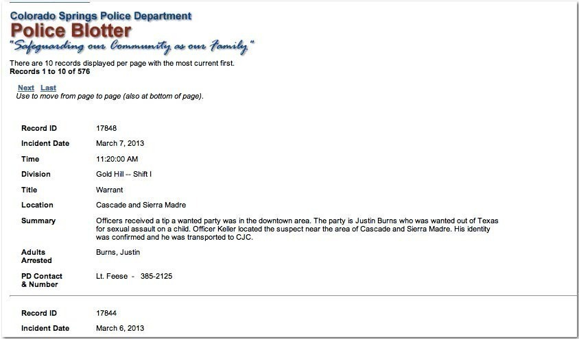
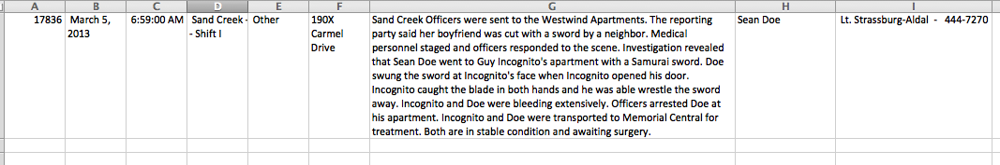
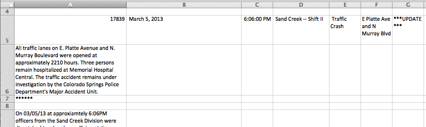
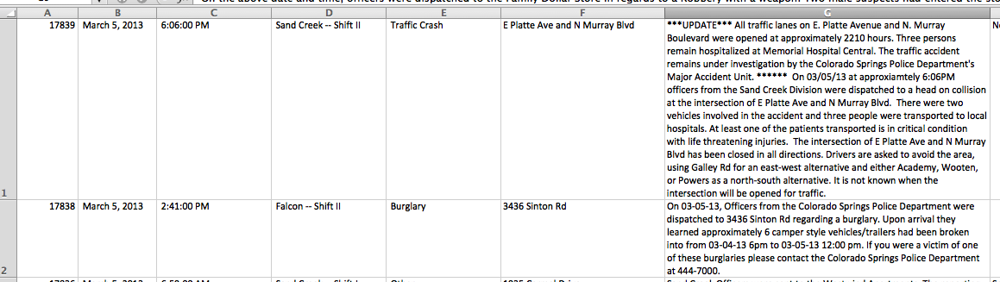

# Sorting a police blotter

The Colorado Springs Police Department posts six months worth of crime incident reports at its website. The data clearly comes from a database but we only have the text of the webpage to work with:

We have to essentially reverse-engineer the output on the webpage to recreate the spreadsheet that the reports originate from. Unfortunately, copying-and-pasting directly from the webpage does not preserve any of the structure.

However, there are enough patterns in the text glob to do what we need with just regular expressions. The end product will look very, *very* convoluted. But I'll show you how it's actually just a bunch of simple pieces all put together.

**Note:** This is just a proof of concept to show you how far you can get with intuitively recognizing patterns in text. If you are actually trying to make usable data from these pages for a real-life project, *this is not how you should do it.* Learning a little bit of how to program in order to automatically web-crawl and parse the pages &ndash; using a scraping library more powerful and easy-to-use than regexes &ndash; is the ideal way to do this.

But let's see how far we can get with regexes.

## Sloppy copy-and-paste

Visit one of the pages at the [Colorado Springs online police blotter](http://www.springsgov.com/units/police/policeblotter.asp). Each page should have 10 reports. 

If you copy-and-paste the entire webpage into a textfile, though, you get a mess like this (the  names have been changed from the actual report but the (*amazing*) events are verbatim):

> 17836 Record ID March 5, 2013 Incident Date 6:59:00 AM Time Sand Creek -- Shift IDivision OtherTitle190X Carmel DriveLocationSand Creek Officers were sent to the Westwind Apartments. The reporting party said her boyfriend was cut with a sword by a neighbor. Medical personnel staged and officers responded to the scene. Investigation revealed that Sean Doe went to Guy Incognito's apartment with a Samurai sword. Doe swung the sword at Incognito's face when Incognito opened his door. Incognito caught the blade in both hands and he was able wrestle the sword away. Incognito and Doe were bleeding extensively. Officers arrested Doe at his apartment. Incognito and Doe were transported to Memorial Central for treatment. Both are in stable condition and awaiting surgery.SummarySean DoeAdults 
Arrested Lt. Strassburg-Aldal  -   444-7270PD Contact 
& Number

What happened? It's a consequence of how the HTML is structured, a topic that we don't need to concern ourselves with. All that matters is we have a jumble.

But luckily, the jumble isn't too bad. The problem is that the data labels, such as "**Record ID**" and "**Adults Arrested**" have been thrown into the text with no separation. However, as long as those data labels stay the same for each record, then we can use them to create a usable regex.

Below is the jumbled text again, except that I've **bolded** the data labels:

> 17836 **Record ID** March 5, 2013 **Incident Date** 6:59:00 AM **Time** Sand Creek -- Shift I**Division** Other**Title**1900 Block of Carmel Drive**Location**Sand Creek Officers were sent to the Westwind Apartments. The reporting party said her boyfriend was cut with a sword by a neighbor. Medical personnel staged and officers responded to the scene. Investigation revealed that Sean Doe went to Guy Incognito's apartment with a Samurai sword. Doe swung the sword at Incognito's face when Incognito opened his door. Incognito caught the blade in both hands and he was able wrestle the sword away. Incognito and Doe were bleeding extensively. Officers arrested Doe at his apartment. Incognito and Doe were transported to Memorial Central for treatment. Both are in stable condition and awaiting surgery.**Summary**Sean Doe**Adults 
Arrested** Lt. Strassburg-Aldal  -   444-7270**PD Contact** 
****& Number**

It appears the data labels come *after* their associated data, e.g:

> **Time** Sand Creek -- Shift I**Division**

## Start loose and simple

Let's try this the sloppiest way we can: use the **dot** operator with the **lazy-star** operator, `*?` to **capture** everything that is *not* one of the actual labels:

Find
: `(.*?)Record ID(.*?)Incident Date(.*?)Time(.*?)Division(.*?)Title(.*?)Location(.*?)Summary(.*?)Adults\s*Arrested(.*?)PD Contact\s*& Number`

**Note:** There's apparently always a line break between "PD Contact" and "& Number"

Why do we use the **star** instead of the **plus**? Some of those fields, such as "**Adults Arrested**", may be empty.

However, this pattern is not quite there. Some of the records have multiple line breaks within certain fields, such as the "**Summary**". The dot operator does not match **newline** characters. So we simply need to change all the instances of `(.*?)` to: `((?:.|\n)*?)`. That looks more complicated that it sounds, because I threw in a non-capturing group. But basically, we've changed the pattern to match either a **dot** (i.e all newline characters) *or* a newline character (i.e. *everything*).

Find
: `((?:.|\n)*?)Record ID((?:.|\n)*?)Incident Date((?:.|\n)*?)Time((?:.|\n)*?)Division((?:.|\n)*?)Title((?:.|\n)*?)Location((?:.|\n)*?)Summary((?:.|\n)*?)Adults\s*Arrested((?:.|\n)*?)PD Contact *\n& Number`

Replace
: `\1\n\2\n\3\n\4\n\5\n\6\n\7\n\8\n\9`

Using the above regex on our sample text, we end up with nine separate lines, each one corresponding to a data field (we don't really need the labels at this point):

	 17836 
	 March 5, 2013 
	 6:59:00 AM 
	 Sand Creek -- Shift I
	 Other
	190X Carmel Drive
	Sand Creek Officers were sent to the Westwind Apartments. The reporting party said her boyfriend was cut with a sword by a neighbor. Medical personnel staged and officers responded to the scene. Investigation revealed that Sean Doe went to Guy Incognito's apartment with a Samurai sword. Doe swung the sword at Incognito's face when Incognito opened his door. Incognito caught the blade in both hands and he was able wrestle the sword away. Incognito and Doe were bleeding extensively. Officers arrested Doe at his apartment. Incognito and Doe were transported to Memorial Central for treatment. Both are in stable condition and awaiting surgery.
	Sean Doe
	 Lt. Strassburg-Aldal  -   444-7270
	

I used newlines in the replacement pattern just to produce something easier to read. You could've used tab characters which would allow you to paste the result directly into Excel:

### Adding a report-ending delimiter 

If you try to apply the regex above to the entire page of 10 reports, you'll find that they don't copy-and-paste so easy into Excel. This is because some of the reports contain extra line breaks. And copying/pasting line breaks into Excel will create problems:

There's a few hacks we can use to clean this up. I think the easiest approach is to adjust the **Replace** pattern:

Replace
: `\1\t\2\t\3\t\4\t\5\t\6\t\7\t\8\t\9--END--`

You can use whatever arbitrary string you want there. The important thing is to have that string denote the end of each report. An example result is:

> 17838 	 March 5, 2013 	 2:41:00 PM 	 Falcon -- Shift II	 Burglary	3400 block of Sinton Rd	On 03-05-13, Officers from the Colorado Springs Police Department were dispatched to Sinton Rd regarding a burglary. Upon arrival they learned approximately 6 camper style vehicles/trailers had been broken into from 03-04-13 6pm to 03-05-13 12:00 pm. If you were a victim of one of these burglaries please contact the Colorado Springs Police Department at 444-7000.		 Lt. Buckley  -   444-7240--END--

After you've run the regex-replace as we did previously, we do *another* find-and-replace: this time, we change all newline characters (either `\n` or `\r`, depending on your text editor) into regular whitespace:

Find
: `\n`

Replace
: *(just a space character)*

And finally, we do one more replacement: change the "end" string into a **newline** character:

Find
: `--END--`

Replace
: `\n`

And then we paste the final result into Excel:

 

## Conclusion

This example is an elaborate exercise to show you how far a regex can get you. In this case, we were lucky enough that the data fields were consistently named. Just to be safe, we could've been much more specific with our pattern, such as looking for numerical digits in the date and time fields. But being lazy worked out for our purposes.

However, I cannot emphasize that in *the real world*, you would not parse this police blotter with just regexes. You would at least write a script to traverse the hundred or so pages to collect the text. And if you know that much coding, you'd also figure out a better way to get it into a spreadsheet than with our lazy regex.

But this doesn't mean the regex work here was just a foolish exercise. We learned how to find a pattern in a jumble, and that's a very worthwhile skill to have when writing a programming script.
