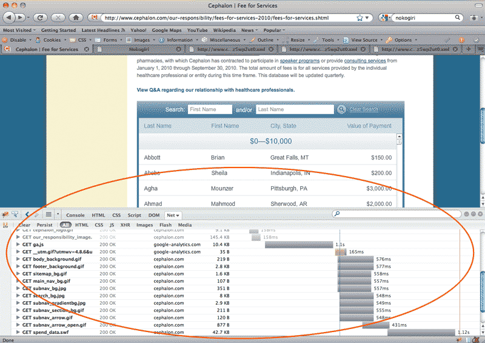
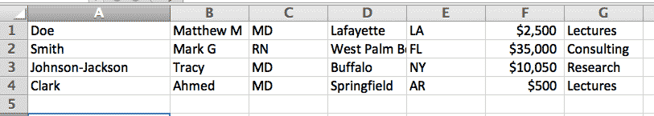

# Converting XML to tab-delimited data

This exercise covers a real-life scenario I encountered while working on the[ Dollars for Docs project at ProPublica](http://projects.propublica.org/docdollars/). As part of a lawsuit settlement, a drug company was required to post online what it paid doctors to promote its products.

They posted the records in a Flash application, which made [it fairly easy to download the data as XML](http://www.propublica.org/nerds/item/reading-flash-data). However, while the XML was in a simple format, it did not import into Excel as a usable spreadsheet.

But XML is a pattern just like any other. This lesson describes how to convert simple XML into a spreadsheet-like format.

## The payments XML

You can download a copy of the [drug company's data at its site](http://www.cephalon.com/HealthcareProfessionals/2009-Fees-for-services.aspx). Check out my [tutorial for more details](http://www.propublica.org/nerds/item/reading-flash-data). However, the company's site has been down at the time of this writing.

But the actual data isn't important. Below is some sample data (with names changed) in the same XML format:

	<dataset>
	<data>
	<row>
	<value>Doe, Matthew M</value>
	<value>MD</value>
	<value>Lafayette, LA</value>
	<value>$2500</value>
	<value>Lectures</value>
	</row>
	<row>
	<value>Smith, Mark G</value>
	<value>RN</value>
	<value>West Palm Beach, FL</value>
	<value>$35000</value>
	<value>Consulting</value>
	</row>
	<row>
	<value>Johnson-Jackson, Tracy</value>
	<value>MD</value>
	<value>Buffalo, NY</value>
	<value>$10050</value>
	<value>Research</value>
	</row>
	<row>
	<value>Clark, Ahmed</value>
	<value>MD</value>
	<value>Springfield, AR</value>
	<value>$500</value>
	<value>Lectures</value>
	</row>
	<data>
	<dataset>

## The pattern

The XML downloaded from the company site was flattened for some reason. If the XML had the typical whitespace formatting for its nested structure, it would look like this:

	<dataset>
		<data>
			<row>
				<value>Doe, Matthew M</value>
				<value>MD</value>
				<value>Lafayette, LA</value>
				<value>$2500</value>
				<value>Lectures</value>
			</row>
			...
		</data>
	</dataset>

However, there's no other type of XML elements except for the `<row>` elements. So essentially we just have to care about breaking apart each `<row>` element and extract the values between the `<value>` elements.
	
This is pretty straightforward. The pattern should include the newline characters between each element:
	
Find
: `<row>\n<value>(.+?)</value>\n<value>(.+?)</value>\n<value>(.+?)</value>\n<value>(.+?)</value>\n<value>(.+?)</value>\n</row>`

Replace
: `\1\t\2\t\3\t\4\t\5`

So this: 

	<row>
	<value>Johnson-Jackson, Tracy</value>
	<value>MD</value>
	<value>Buffalo, NY</value>
	<value>$10050</value>
	<value>Research</value>
	</row>
		
Becomes this:
	
	Johnson-Jackson, Tracy	MD	Buffalo, NY	$10050	Research

**Note:** Of course, it's possible to simply do a replacement of the *literal* values, e.g. replacing `</value>` with `\t` and `</row>` with `\n`, which would simplify the **Replace** operation.

## Add more delimitation

Why restrict ourselves to organizing the values as the drug company does? If we want to analyze the data by U.S. state, for example, we'd want to format the location `<value>` element (the third element):
	
	<value>Buffalo, NY</value>
	
&ndash; into a *city* and *state* field:

	Buffalo\tNY
	
This doesn't require anything more than just adding a few more capturing groups so that the *name* value is divided into *lastname* and *firstname* values, and that *location* is separated into *city* and *state*:

Find
: `<row>\n<value>(.+?), (.+?)</value>\n<value>(.+)</value>\n<value>(.+?), ([A-Z]{2})</value>\n<value>(.+)</value>\n<value>(.+)</value>\n</row>`

Replace
: `\1\t\2\t\3\t\4\t\5\t\6\t\7`

If you apply the above pattern to the sample data at the beginning of the chapter, you'll get seven columns of tab-delimited data:

	Doe	Matthew M	MD	Lafayette	LA	$2500	Lectures
	Smith	Mark G	RN	West Palm Beach	FL	$35000	Consulting
	Johnson-Jackson	Tracy	MD	Buffalo	NY	$10050	Research
	Clark	Ahmed	MD	Springfield	AR	$500	Lectures

You can directly paste this into Excel:

